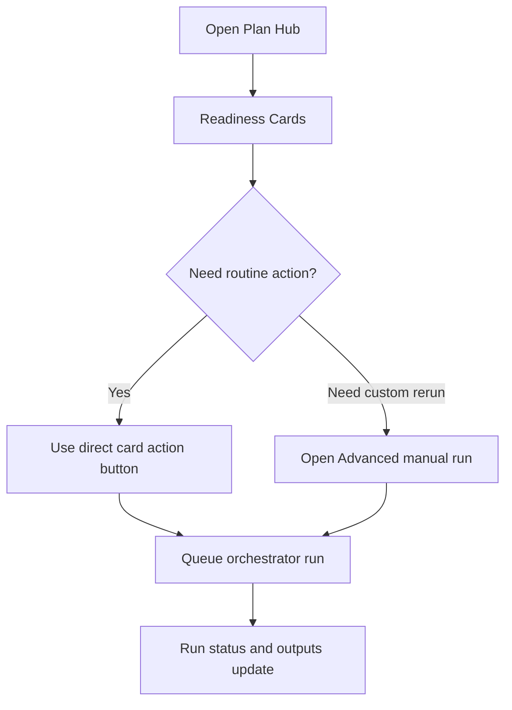

# FEAT: Simplify Plan Hub Primary Actions

* **ID:** FEAT_plan_hub_simplification
* **Status:** Implemented
* **Owner/Area:** UI / Planning
* **Last-Updated:** 2026-04-13
* **Related:** `doc/ui/pages/plan_hub.md`, `doc/specs/features/FEAT_plan_hub_direct_step_actions.md`, `doc/specs/features/FEAT_plan_hub_phase_step_isolation.md`

---

## 1) Context / Problem

**Current behavior**

* Plan Hub exposes a generic runner panel with `Run mode`, `Scope`, optional override, custom run id, and validate-only controls in the main page layout.
* The same page also exposes direct action buttons on readiness cards.
* Users must understand internal execution concepts such as `Orchestrated` vs `Scoped` and scope propagation even for routine planning.

**Problem**

* The main planning UI is optimized for internal execution flexibility instead of the dominant user intent: trigger the next valid planning step and understand what is blocked.
* The manual runner panel duplicates the direct card actions and makes the page look more complex than the planning model actually is.
* When planning is blocked, the current UI places too much emphasis on run configuration rather than on the concrete next actionable step.

**Constraints**

* Existing worker queue, run store, and orchestration semantics must remain intact.
* Direct actions must keep using the orchestrator/service helpers; page code must not bypass orchestration.
* Advanced/scoped/manual execution still has diagnostic value and should remain available, but not as the primary UI.
* The simplified UI must continue supporting explicit phase/week selection for direct phase/week actions.

---

## 2) Goals & Non-Goals

**Goals**

* [ ] Make direct artefact actions the primary control surface of Plan Hub.
* [ ] Remove `Run mode` / `Scope` / free-form manual run controls from the default visible layout.
* [ ] Preserve advanced manual execution in a secondary collapsed area.
* [ ] Make the page emphasize recommended next actions and concrete blockers.

**Non-Goals**

* [ ] No change to underlying planning dependency semantics.
* [ ] No change to background worker, queue priority, or run-store schema.
* [ ] No new planning artefacts or schema changes.

---

## 3) Proposed Behavior

**User/System behavior**

* The main Plan Hub view shows readiness state plus direct action buttons on the relevant cards.
* For the common path, users trigger planning from those buttons only.
* A compact `Recommended next action` area can still surface the primary next step.
* The old generic run-builder remains available only inside an `Advanced manual run` expander.

**UI impact**

* UI affected: Yes
* If Yes: `src/rps/ui/pages/plan/hub.py`

### UI Flow (Mermaid)

**Non-UI behavior (if applicable)**

* Components involved: `src/rps/ui/pages/plan/hub.py`, existing queue/orchestrator helpers, run store.
* Contracts touched: none beyond current UI action wiring.

---

## 4) Implementation Analysis

**Components / Modules**

* `src/rps/ui/pages/plan/hub.py`: restructure layout so card actions are primary and manual run inputs are collapsed.
* Existing run helpers in `src/rps/ui/pages/plan/hub.py`: reused to queue the same runs as before.
* `tests/test_plan_pages.py`: add/update AppTest or logic tests for simplified hub presentation and action scope behavior.

**Data flow**

* Inputs: readiness state, current athlete/year/week, current phase, available direct actions.
* Processing: compute recommended action and render direct-action-first UI; advanced manual run uses the same execution builder.
* Outputs: same queued run records and artefact writes as before.

**Schema / Artefacts**

* New artefacts: none.
* Changed artefacts: none.
* Validator implications: none.

---

## 5) Impact Analysis (complete)

**Compatibility**

* Backward compatible: Yes
* Breaking changes: the main visible Plan Hub controls change, but advanced functionality remains available.
* Fallback behavior: advanced manual run expander exposes the prior generic controls.

**Conflicts with ADRs / Principles**

* Potential conflicts: none identified.
* Resolution: preserves `UI pages must not call agents directly; delegate to orchestrator/service helpers`.

**Impacted areas**

* UI: major simplification of primary Plan Hub controls.
* Pipeline/data: none.
* Renderer: none.
* Workspace/run-store: none.
* Validation/tooling: tests need updates.
* Deployment/config: none.

**Required refactoring**

* Extract/reshape hub rendering so default actions and advanced manual controls are clearly separated.
* Reduce duplicated explanatory text around generic run modes.

---

## 6) Options & Recommendation

### Option A — Direct-actions-first UI with advanced fallback

**Summary**

* Show only card actions and recommended next action by default.
* Move the generic run-builder into a collapsed advanced area.

**Pros**

* Matches actual user intent.
* Reduces cognitive load.
* Keeps debugging flexibility without polluting the main flow.

**Cons**

* Slightly less discoverable for highly custom reruns.

**Risk**

* Some existing users may initially look for the old runner panel.

### Option B — Keep current UI and improve labels only

**Summary**

* Retain the generic runner panel but tweak text and defaults.

**Pros**

* Minimal implementation risk.
* No layout transition.

**Cons**

* Does not address the core usability issue.
* Continues exposing internal workflow mechanics as the main control model.

### Recommendation

* Choose: Option A
* Rationale: the page already knows dependencies and available actions, so the main UI should surface direct planning actions rather than a generic execution console.

---

## 7) Acceptance Criteria (Definition of Done)

* [ ] Plan Hub default layout no longer shows `Run mode` and `Scope` controls in the main visible panel.
* [ ] Routine planning remains possible entirely through direct action buttons on readiness cards and/or recommended next action.
* [ ] An `Advanced manual run` expander preserves generic scoped/orchestrated execution controls.
* [ ] Existing direct card actions still queue the same execution semantics as before.
* [ ] Validation passes: targeted pytest, `python3 -m py_compile`, relevant smoke checks.
* [ ] No regressions in readiness rendering, direct action queueing, or run summary text.

---

## 8) Migration / Rollout

**Migration strategy**

* No schema or data migration.

**Rollout / gating**

* Feature flag / config: none.
* Safe rollback: restore previous `hub.py` layout while keeping orchestration changes intact.

---

## 9) Risks & Failure Modes

* Failure mode: direct action buttons become the only visible control and miss an important custom rerun case.
  * Detection: user feedback, inability to trigger a special rerun from the page.
  * Safe behavior: advanced manual run remains available.
  * Recovery: extend advanced area or add a narrowly scoped additional button.

* Failure mode: simplified layout accidentally stops exposing current phase/week selectors where needed.
  * Detection: tests and inability to target current/next phase or week.
  * Safe behavior: advanced manual run remains available.
  * Recovery: restore selector visibility for affected cards only.

---

## 10) Observability / Logging

**New/changed events**

* No new backend events required.
* Existing run-store updates remain the main observability channel.

**Diagnostics**

* `runtime/athletes/<athlete>/runs/`
* `rps.ui.run_store` logs
* Plan Hub run history/status table

---

## 11) Documentation Updates

Update these docs as part of implementation:

* [ ] `doc/ui/pages/plan_hub.md` — revise runner panel description to direct-actions-first with advanced manual run.
* [ ] `CHANGELOG.md` — note simplified Plan Hub primary controls.

---

## 12) Link Map (no duplication; links only)

* UI flows/actions: `doc/ui/ui_spec.md`
* UI contract (Streamlit): `doc/ui/streamlit_contract.md`
* Architecture: `doc/architecture/system_architecture.md`
* Workspace: `doc/architecture/workspace.md`
* Validation / runbooks: `doc/runbooks/validation.md`
* Existing Plan Hub docs: `doc/ui/pages/plan_hub.md`

---

## Out of Scope / Deferred

* Add a richer progress UI for long-running planning steps.
* Rework backend orchestration semantics beyond current direct/scoped action mapping.
