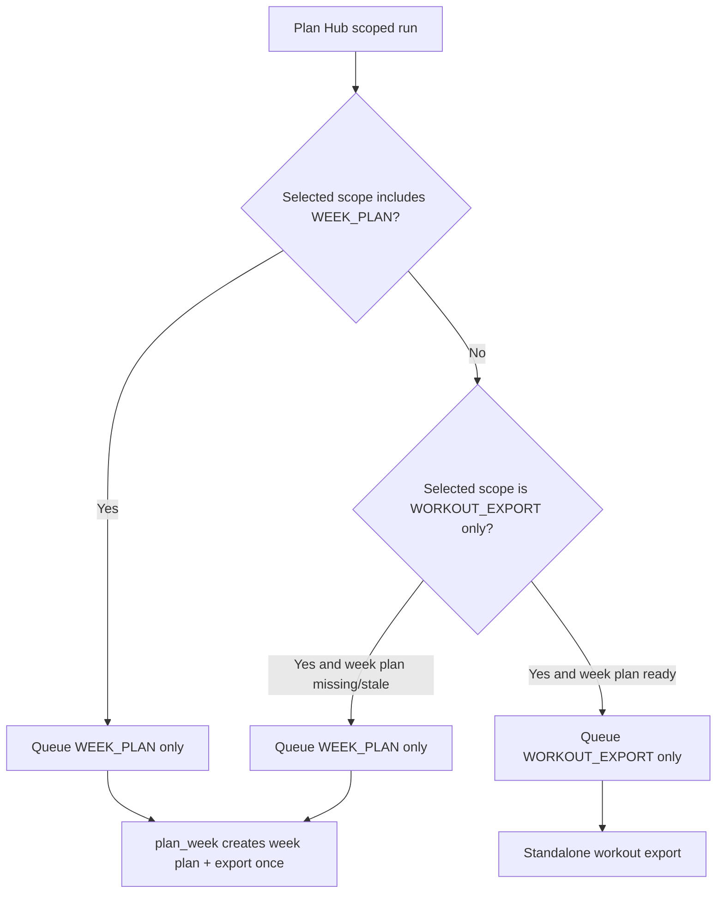

# FEAT: Plan Hub Week Export Idempotency

* **ID:** FEAT_plan_hub_week_export_idempotency
* **Status:** Implemented
* **Owner/Area:** Plan Hub UI / Plan Week Orchestrator
* **Last-Updated:** 2026-04-27
* **Related:** `src/rps/ui/pages/plan/hub.py`, `src/rps/orchestrator/plan_week.py`

---

## 1) Context / Problem

**Current behavior**

* Scoped and chained Plan Hub runs can queue both `WEEK_PLAN` and `WORKOUT_EXPORT` in the same run.
* The worker executes `WEEK_PLAN` by calling `plan_week(...)`.
* `plan_week(...)` already performs the local workout export as part of the week-planning flow.

**Problem**

* When the same run also contains a later `WORKOUT_EXPORT` step, the export runs twice for the same `run_id` and ISO week.
* This produces duplicate `INTERVALS_WORKOUTS` artefacts and confusing logs.

**Constraints**

* `Build Workouts` as a standalone scoped action must still work when a valid `WEEK_PLAN` already exists.
* If `Build Workouts` is requested while `WEEK_PLAN` is missing/stale, the system must still create the week plan first and export once.
* Existing worker/orchestrator separation must remain intact.

---

## 2) Goals & Non-Goals

**Goals**

* [x] Prevent duplicate workout exports within a single Plan Hub run.
* [x] Keep `Week Plan` scoped runs producing workouts automatically.
* [x] Keep standalone `Build Workouts` usable.

**Non-Goals**

* [x] Changing workout export artefact schemas.
* [x] Reworking the underlying `plan_week(...)` export contract.

---

## 3) Proposed Behavior

**User/System behavior**

* If a selected Plan Hub run includes `WEEK_PLAN`, the run must not also queue a separate `WORKOUT_EXPORT` step.
* `WEEK_PLAN` remains the integrated boundary that creates/refreshes the week plan and then exports workouts once.
* `WORKOUT_EXPORT` remains selectable only when it is the highest required step for the run.

**UI impact**

* UI affected: Yes
* If Yes: Plan Hub queued steps for `Week Plan`, `Build Workouts`, and any broader scope containing week planning

### UI Flow (Mermaid)

**Non-UI behavior (if applicable)**

* Components involved: `src/rps/ui/pages/plan/hub.py`
* Contracts touched: execution-step planning only

---

## 4) Implementation Analysis

**Components / Modules**

* `src/rps/ui/pages/plan/hub.py`: collapse redundant `WORKOUT_EXPORT` when `WEEK_PLAN` is already queued in the same run.
* `tests/test_plan_pages.py`: update scoped-run expectations and add regression coverage for idempotent step plans.

**Data flow**

* Inputs: readiness state, selected scope, scope-to-step mapping
* Processing: resolve scoped step selection, then prune redundant `WORKOUT_EXPORT` if `WEEK_PLAN` is present
* Outputs: one execution-step list per run without duplicate export intent

**Schema / Artefacts**

* New artefacts: none
* Changed artefacts: none
* Validator implications: none

---

## 5) Impact Analysis (complete)

**Compatibility**

* Backward compatible: Yes
* Breaking changes: none
* Fallback behavior: standalone `WORKOUT_EXPORT` still queues when no `WEEK_PLAN` step is part of the run

**Conflicts with ADRs / Principles**

* Potential conflicts: none
* Resolution: aligns with the existing principle that UI pages queue orchestrator work rather than duplicating it

**Impacted areas**

* UI: run-step preview/queue semantics become less redundant
* Pipeline/data: duplicate `INTERVALS_WORKOUTS` writes disappear
* Renderer: none
* Workspace/run-store: fewer duplicate artefacts per run
* Validation/tooling: targeted tests updated
* Deployment/config: none

**Required refactoring**

* Centralize redundant-step pruning in Plan Hub step selection

---

## 6) Options & Recommendation

### Option A — Prune redundant `WORKOUT_EXPORT` when `WEEK_PLAN` is queued

**Summary**

* Keep `plan_week(...)` as the integration boundary and remove duplicate queue entries upstream.

**Pros**

* Minimal change surface.
* Preserves existing orchestrator behavior.
* Fixes all scopes that include `WEEK_PLAN`.

**Cons**

* Queue semantics remain aware of orchestrator coupling.

**Risk**

* Low.

### Option B — Keep both steps but make the worker skip the second export

**Summary**

* Preserve the queue shape and dedupe at execution time.

**Pros**

* No UI-side step changes.

**Cons**

* More hidden behavior.
* Leaves misleading queued steps in run history.

### Recommendation

* Choose: Option A
* Rationale: remove redundant intent at the source; the run plan should reflect actual execution.

---

## 7) Acceptance Criteria (Definition of Done)

* [x] Scoped `Week Plan` queues only `WEEK_PLAN` when all prerequisites are already ready.
* [x] Scoped `Build Workouts` queues only `WEEK_PLAN` when the week plan is missing/stale.
* [x] Standalone `Build Workouts` still queues `WORKOUT_EXPORT` when the week plan is already ready.
* [x] Validation passes: `python3 -m py_compile $(git ls-files '*.py')`, `./scripts/run_lint.sh`, `./scripts/run_typecheck.sh`, relevant pytest
* [x] No regressions in: Plan Hub step planning tests

---

## 8) Migration / Rollout

**Migration strategy**

* None.

**Rollout / gating**

* Feature flag / config: none
* Safe rollback: revert Plan Hub step-pruning logic

---

## 9) Risks & Failure Modes

* Failure mode: `Build Workouts` no longer exports when week plan is already ready
  * Detection: queued steps omit `WORKOUT_EXPORT` for standalone workout-export scope with ready week plan
  * Safe behavior: run does nothing destructive
  * Recovery: inspect scoped step pruning in `hub.py`

* Failure mode: duplicate exports still occur in a run containing `WEEK_PLAN`
  * Detection: same `run_id` logs two workout exports
  * Safe behavior: duplicate artefacts only, no corrupted week plan
  * Recovery: inspect step selection and worker step order

---

## 10) Observability / Logging

**New/changed events**

* No new event types

**Diagnostics**

* Plan Hub run-store `steps`
* `rps.orchestrator.plan_week` logs per `run_id`
* `INTERVALS_WORKOUTS` artefact writes per `run_id`

---

## 11) Documentation Updates

Update these docs as part of implementation:

* [x] `doc/specs/features/FEAT_plan_hub_week_export_idempotency.md` — record redundant step pruning for week/export runs
* [ ] `doc/ui/pages/plan_hub.md` — optional follow-up if step semantics need UI wording updates

---

## 12) Link Map (no duplication; links only)

* UI flows/actions: `doc/ui/flows.md`
* UI contract (Streamlit): `doc/ui/streamlit_contract.md`
* Architecture: `doc/architecture/system_architecture.md`
* Workspace: `doc/architecture/workspace.md`
* Schema versioning: `doc/architecture/schema_versioning.md`
* Logging policy: `doc/specs/contracts/logging_policy.md`
* Validation / runbooks: `doc/runbooks/validation.md`
* ADRs: `doc/adr/ADR-001-ui-delegates-orchestrators.md`
