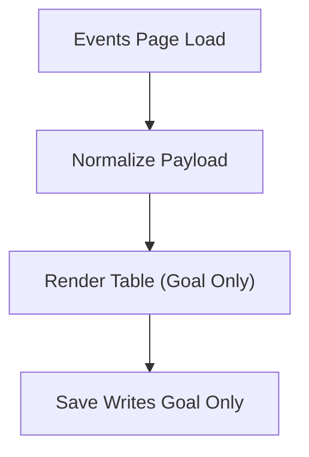

# FEAT: Remove Planning Event Objective Field

* **ID:** FEAT_remove_event_objective
* **Status:** Approved
* **Owner/Area:** UI + Schemas
* **Last-Updated:** 2026-02-08
* **Related:** [doc/ui/pages/athlete_profile/events.md](doc/ui/pages/athlete_profile/events.md) (if present), specs/schemas/planning_events.schema.json

---

## 1) Context / Problem

**Current behavior**

* Planning Events payloads include both `goal` and `objective`.
* The Events table renders both columns, which appear identical in practice.

**Problem**

* Duplicate fields create UI noise and confusion.
* Schema duplication complicates downstream contracts and validation.

**Constraints**

* Schema changes require a version bump and changelog entry.
* Bundled schemas must be regenerated.

---

## 2) Goals & Non-Goals

**Goals**

* [ ] Remove `objective` from Planning Events schema and payloads.
* [ ] Render only `goal` in the Events table.
* [ ] Migrate existing payloads safely (drop `objective` or map into `goal` if missing).

**Non-Goals**

* [ ] No change to event ranking/priority semantics.
* [ ] No change to other event fields.

---

## 3) Proposed Behavior

**User/System behavior**

* Events table shows a single goals column.
* Stored payloads include only `goal` for planning events.
* Legacy payloads with `objective` are normalized on load/upgrade.

**UI impact**

* UI affected: Yes
* Athlete Profile → Events table: remove “Objective(s)” column.

### UI Flow (Mermaid)

**Non-UI behavior (if applicable)**

* Components involved: `specs/schemas/planning_events.schema.json`, Events UI, payload migration helper.
* Contracts touched: Planning Events schema.

---

## 4) Implementation Analysis

**Components / Modules**

* `specs/schemas/planning_events.schema.json`: remove `objective` field, bump schema version.
* `specs/knowledge/_shared/sources/schemas/bundled/planning_events.schema.json`: regenerated.
* Events UI: remove Objective column and legacy mapping.
* Legacy upgrade: drop `objective`, or map into `goal` when `goal` is missing.

**Data flow**

* Inputs: existing planning events payloads.
* Processing: normalize fields; remove `objective`.
* Outputs: updated payloads and UI table.

**Schema / Artefacts**

* New artefacts: None.
* Changed artefacts: `PLANNING_EVENTS` schema (version bump).
* Validator implications: run schema required checker and bundler.

---

## 5) Impact Analysis (complete)

**Compatibility**

* Backward compatible: Yes (migration/normalization for legacy payloads).
* Breaking changes: Schema contract removes `objective`.
* Fallback behavior: If `goal` missing but `objective` present, map `objective` to `goal`.

**Conflicts with ADRs / Principles**

* Potential conflicts: None.
* Resolution: N/A.

**Impacted areas**

* UI: Events table columns + payload editor.
* Pipeline/data: planning events schema + validation.
* Renderer: none.
* Workspace/run-store: updated payloads on save/upgrade.
* Validation/tooling: schema checks + bundler.
* Deployment/config: none.

**Required refactoring**

* Remove any `objective` rendering or persistence paths.

---

## 6) Options & Recommendation

### Option A — Remove Objective (Recommended)

**Summary**

* Drop `objective` from schema and payloads, show only `goal`.

**Pros**

* Simplifies UI and contracts.
* Reduces confusion and maintenance.

**Cons**

* Requires schema bump + migration.

### Option B — Keep Both (Not Recommended)

**Summary**

* Continue to store/render both fields.

**Pros**

* No schema change.

**Cons**

* Ongoing confusion, duplicate data.

### Recommendation

* Choose: Option A.
* Rationale: Removes redundancy and clarifies the schema/UI.

---

## 7) Acceptance Criteria (Definition of Done)

* [ ] Events UI no longer displays `objective`.
* [ ] `specs/schemas/planning_events.schema.json` removes `objective` and bumps version.
* [ ] Bundled schemas regenerated and validated.
* [ ] Legacy events upgrade removes `objective` or maps into `goal`.
* [ ] Validation passes: `python3 scripts/check_schema_required.py`, `python3 scripts/bundle_schemas.py`.

---

## 8) Migration / Rollout

**Migration strategy**

* On load/upgrade: if `goal` missing and `objective` present, set `goal = objective`.
* Remove `objective` in persisted payloads.

**Rollout / gating**

* Feature flag / config: None.
* Safe rollback: restore schema version + UI column if needed.

---

## 9) Risks & Failure Modes

* Failure mode: Legacy payloads lose goal text.

  * Detection: Missing `goal` after upgrade.
  * Safe behavior: Map `objective` to `goal`.
  * Recovery: Re-run upgrade or restore backup.

---

## 10) Observability / Logging

* Log when legacy payloads are normalized: number of events updated and whether `objective` -> `goal` mapping occurred.

---

## 11) Documentation Updates

* Update Events UI doc (if present) to reflect single Goals column.
* Update schema/versioning notes.
* Update CHANGELOG.

---

## 12) Link Map

* `specs/schemas/planning_events.schema.json`
* `specs/knowledge/_shared/sources/schemas/bundled/planning_events.schema.json`
* [[doc/ui/pages/athlete_profile/events.md](doc/ui/pages/athlete_profile/events.md)](doc/ui/pages/athlete_profile/events.md) (if present)
* [[doc/overview/artefact_flow.md](doc/overview/artefact_flow.md)](doc/overview/artefact_flow.md)
* [[doc/architecture/workspace.md](doc/architecture/workspace.md)](doc/architecture/workspace.md)
