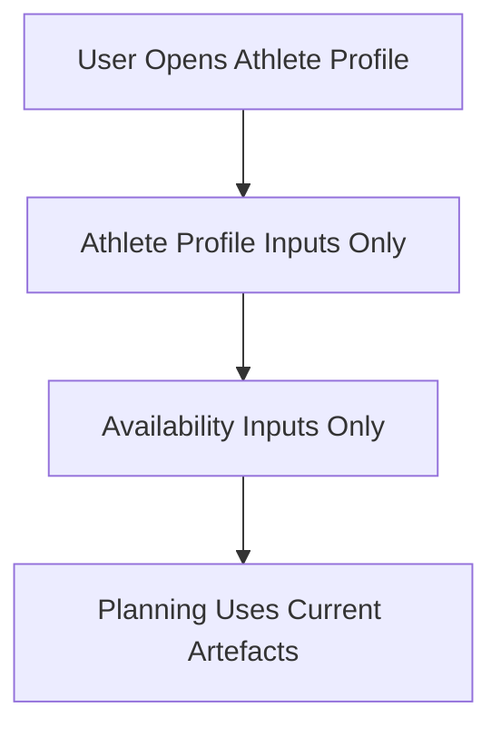

# FEAT: Remove Legacy Season Brief + Legacy Path Support

* **ID:** FEAT_remove_legacy_support
* **Status:** Implemented
* **Owner/Area:** Core / Workspace / UI
* **Last-Updated:** 2026-02-10
* **Related:** N/A

---

## 1) Context / Problem

**Current behavior**

* Legacy Season Brief parsing and compatibility helpers remain in the repo.
* Workspace index manager still normalizes legacy paths.
* Run-store supports a legacy JSONL fallback.
* Schemas/specs still reference `season_brief_ref` and `availability.source_type=season_brief`.

**Problem**

* Legacy code paths increase complexity and cause confusion.
* The system has moved to explicit Athlete Profile + Availability inputs and does not need legacy inputs.
* Run-store and workspace path normalization should be single-path to avoid mismatches.

**Constraints**

* No new dependencies.
* Update schemas and bundled schemas when removing fields or enums.
* Keep UI stable and predictable.

---

## 2) Goals & Non-Goals

**Goals**

* [x] Remove legacy Season Brief parsing and UI entrypoints.
* [x] Remove legacy workspace path normalization.
* [x] Remove run-store legacy JSONL fallback.
* [x] Remove `season_brief_ref` from schemas and specs.
* [x] Update docs to remove legacy references.

**Non-Goals**

* [ ] Introduce new inputs or replace Athlete Profile/Availability flows.
* [ ] Change planning logic outside of required schema/contract updates.

---

## 3) Proposed Behavior

**User/System behavior**

* UI and pipeline accept only the current Athlete Profile + Availability inputs.
* Workspace paths are no longer normalized from legacy layouts.
* Run-store reads only current run-store layout.

**UI impact**

* UI affected: Yes
* Remove Season Brief page/links and any legacy copy referencing Season Brief.

### UI Flow (Mermaid)

**Non-UI behavior (if applicable)**

* Components involved: workspace index manager, run-store, data pipeline season-brief parser, schemas.
* Contracts touched: season/phase contracts, availability spec, scenario/season specs.

---

## 4) Implementation Analysis

**Components / Modules**

* `src/rps/data_pipeline/season_brief_availability.py`: remove legacy parser.
* `src/rps/ui/pages/athlete_profile/season_brief.py`: remove page/entrypoint.
* `src/rps/ui/pages/athlete_profile/data_operations.py`: remove legacy conversion hooks.
* `src/rps/workspace/index_manager.py`: remove legacy path normalization.
* `src/rps/ui/run_store.py`: remove legacy JSONL fallback.
* `src/rps/workspace/types.py` + `src/rps/workspace/paths.py`: remove Season Brief types/paths.
* Rendering/templates: remove `season_brief_ref` usage.

**Data flow**

* Inputs: Athlete Profile, Planning Events, Logistics, Availability.
* Processing: no legacy conversion steps.
* Outputs: unchanged artefacts but without `season_brief_ref`.

**Schema / Artefacts**

* Changed artefacts: Season Plan, Season Scenarios, Availability.
* Validator implications: update bundled schemas and run schema checks.

---

## 5) Impact Analysis (complete)

**Compatibility**

* Backward compatible: No
* Breaking changes: legacy Season Brief inputs and legacy path normalization removed.
* Fallback behavior: none (hard cutover).

**Conflicts with ADRs / Principles**

* Potential conflicts: None known.
* Resolution: N/A

**Impacted areas**

* UI: remove Season Brief page, references, and help text.
* Pipeline/data: remove legacy season-brief parsing.
* Renderer: remove `season_brief_ref` references.
* Workspace/run-store: remove legacy path normalization and JSONL fallback.
* Validation/tooling: update schemas and bundler.
* Deployment/config: none.

**Required refactoring**

* Remove legacy types/paths.
* Update schemas/specs and bundled schemas.

---

## 6) Options & Recommendation

### Option A (recommended) — Hard cutover

**Summary**

* Remove all legacy Season Brief support, legacy path normalization, and run-store fallback.

**Pros**

* Simplifies codebase and reduces failure modes.

**Cons**

* Breaks legacy inputs and old workspaces.

**Risk**

* Missing references left in docs/specs/schemas.

### Option B — Keep legacy behind flag

**Summary**

* Keep legacy code paths gated by a config flag.

**Pros**

* Easier transition for older data.

**Cons**

* Continued complexity and test burden.

### Recommendation

* Choose: Option A
* Rationale: Simplest long-term maintenance; user requested hard cutover.

---

## 7) Acceptance Criteria (Definition of Done)

* [x] Legacy Season Brief page/parser removed.
* [x] Legacy path normalization removed.
* [x] Run-store legacy JSONL fallback removed.
* [x] Schemas/specs updated (no `season_brief_ref`, no `availability.source_type=season_brief`).
* [x] Bundled schemas regenerated and checks pass.
* [x] Changelog updated.
* [x] Validation passes: `python3 scripts/check_schema_required.py` and `python3 scripts/bundle_schemas.py`.

---

## 8) Migration / Rollout

**Migration strategy**

* No migration; break legacy support.

**Rollout / gating**

* No feature flag.
* Safe rollback: restore removed files and schema fields from git history.

---

## 9) Risks & Failure Modes

* Failure mode: hidden legacy references remain.
  * Detection: schema validation errors, runtime imports failing.
  * Safe behavior: fail fast with clear error.
  * Recovery: remove remaining references.

---

## 10) Observability / Logging

**New/changed events**

* None.

**Diagnostics**

* Run-store logs and schema validation errors.

---

## 11) Documentation Updates

* [ ] `doc/overview/artefact_flow.md` — remove Season Brief references.
* [ ] `doc/specs/features/FEAT_remove_cli_entrypoint.md` — update references if needed.
* [ ] `doc/ui/ui_spec.md` — remove Season Brief references.
* [ ] `doc/architecture/workspace.md` — remove legacy paths.

---

## 12) Link Map (no duplication; links only)

* UI flows/actions: `doc/ui/ui_spec.md`
* UI contract (Streamlit): `doc/ui/streamlit_contract.md`
* Architecture: `doc/architecture/system_architecture.md`
* Workspace: `doc/architecture/workspace.md`
* Schema versioning: `doc/architecture/schema_versioning.md`
* Validation / runbooks: `doc/runbooks/validation.md`
