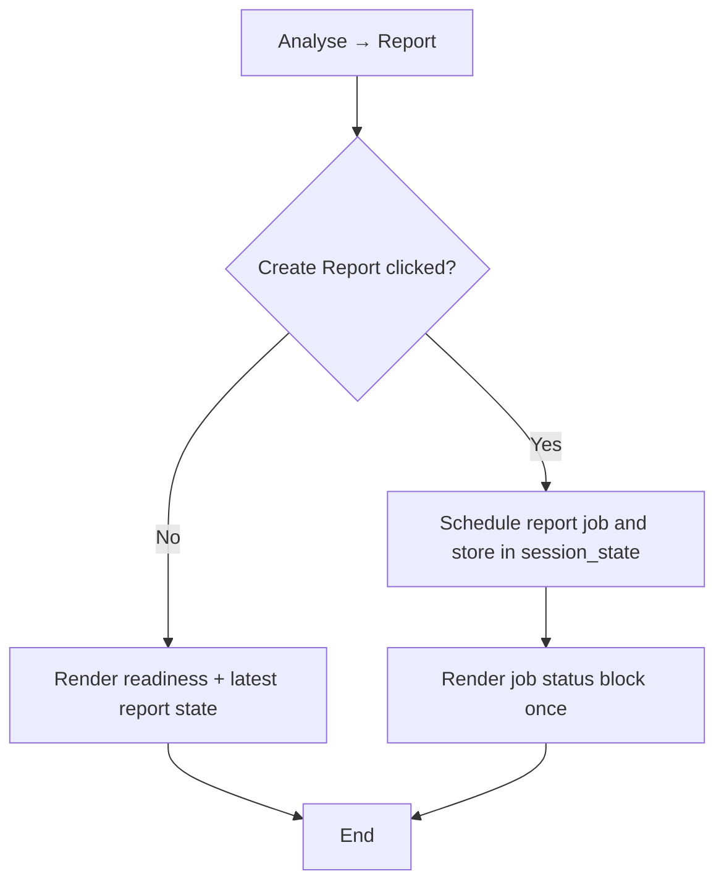

# FEAT: Report page renders a single active job message

* **ID:** FEAT_report_page_single_job_message
* **Status:** Implemented
* **Owner/Area:** UI / Performance Report
* **Last-Updated:** 2026-05-11
* **Related:** `src/rps/ui/pages/performance/report.py`

---

## 1) Context / Problem

**Current behavior**

* Clicking `Create Report` on Analyse → Report can show the same `Creating performance report...` info message twice in the same rerun.

**Problem**

* The page renders the active job message once directly in the button handler and again in the shared job-status block.
* The duplicate banner is noisy and violates the single-banner/single-message UI rule for non-Coach pages.

**Constraints**

* The page must keep its existing background job behavior and rerun polling.
* The fix should be local to the Report page and must not change report orchestration.

---

## 2) Goals & Non-Goals

**Goals**

* [x] Render the active report-job message exactly once per page run.
* [x] Preserve existing report creation and status-panel behavior.

**Non-Goals**

* [x] No change to report generation orchestration or run-store semantics.
* [x] No redesign of the Report page status UX beyond removing the duplicate message.

---

## 3) Proposed Behavior

**User/System behavior**

* When the user clicks `Create Report`, the page stores/schedules the background job and renders the job message from a single shared job-status block.
* The page must not show two identical `Creating performance report...` info boxes in one render.

**UI impact**

* UI affected: Yes
* If Yes: Analyse → Report action flow and transient job-message rendering.

### UI Flow (Mermaid)

**Non-UI behavior (if applicable)**

* Components involved: `src/rps/ui/pages/performance/report.py`
* Contracts touched: none

---

## 4) Implementation Analysis

**Components / Modules**

* `src/rps/ui/pages/performance/report.py`: remove the extra immediate `st.info(job["message"])` call from the create path and rely on the shared `if job:` render block.
* `tests/test_plan_pages.py`: add a regression test for single rendering of the active job message.

**Data flow**

* Inputs: session-state report job, create button state
* Processing: schedule job or reuse existing one, then render one shared message
* Outputs: single info box for the current report job message

**Schema / Artefacts**

* New artefacts: none
* Changed artefacts: none
* Validator implications: none

---

## 5) Impact Analysis (complete)

**Compatibility**

* Backward compatible: Yes
* Breaking changes: none
* Fallback behavior: existing status panel remains the authoritative summary if no job is present

**Conflicts with ADRs / Principles**

* Potential conflicts: none
* Resolution: aligns with existing UI single-banner principles

**Impacted areas**

* UI: Report page transient job messaging
* Pipeline/data: none
* Renderer: none
* Workspace/run-store: none
* Validation/tooling: UI regression test only
* Deployment/config: none

**Required refactoring**

* Remove duplicated message rendering path in the Report page action handler.

---

## 6) Options & Recommendation

### Option A — single shared job render block

**Summary**

* Keep the create button handler focused on state changes and render the active message only from the shared `if job:` block.

**Pros**

* Minimal change
* Lowest regression risk
* Matches the page's existing job-polling structure

**Cons**

* Keeps message rendering split conceptually across button handling and job display, though only one path actually renders

**Risk**

* Low

### Option B — introduce a dedicated render helper for all report banners

**Summary**

* Refactor page messaging into a helper that owns all transient banners.

**Pros**

* Stronger structural cleanup

**Cons**

* More invasive than the bug warrants
* Higher regression surface

### Recommendation

* Choose: Option A
* Rationale: it removes the bug directly without broadening scope.

---

## 7) Acceptance Criteria (Definition of Done)

* [x] Clicking `Create Report` does not render duplicate `Creating performance report...` info messages in one page run.
* [x] Report page still renders without errors.
* [x] Validation passes: `python3 -m py_compile $(git ls-files '*.py')`, targeted `pytest`, lint, typecheck.
* [x] No regressions in Report page readiness/action flow.
* [x] Performance guardrail: no extra rerun work introduced.

---

## 8) Migration / Rollout

**Migration strategy**

* None

**Rollout / gating**

* Feature flag / config: none
* Safe rollback: restore the removed immediate `st.info(...)` call

---

## 9) Risks & Failure Modes

* Failure mode: the page stops showing any immediate feedback after clicking `Create Report`
  * Detection: AppTest or manual UI check shows no active-job info message
  * Safe behavior: status panel still reflects running state
  * Recovery: restore immediate render or fix shared job block condition

---

## 10) Observability / Logging

**New/changed events**

* None

**Diagnostics**

* Report page UI state
* Existing run-store/performance-report background run logs

---

## 11) Documentation Updates

Update these docs as part of implementation:

* [x] `doc/ui/pages/performance_report.md` — clarify that the active report job message renders once.
* [x] `CHANGELOG.md` — record the duplicate message fix.

## 12) Link Map (no duplication; links only)

* UI flows/actions: `doc/ui/ui_spec.md`
* UI contract (Streamlit): `doc/ui/streamlit_contract.md`
* Architecture: `doc/architecture/system_architecture.md`
* Workspace: `doc/architecture/workspace.md`
* Validation / runbooks: `doc/runbooks/validation.md`
