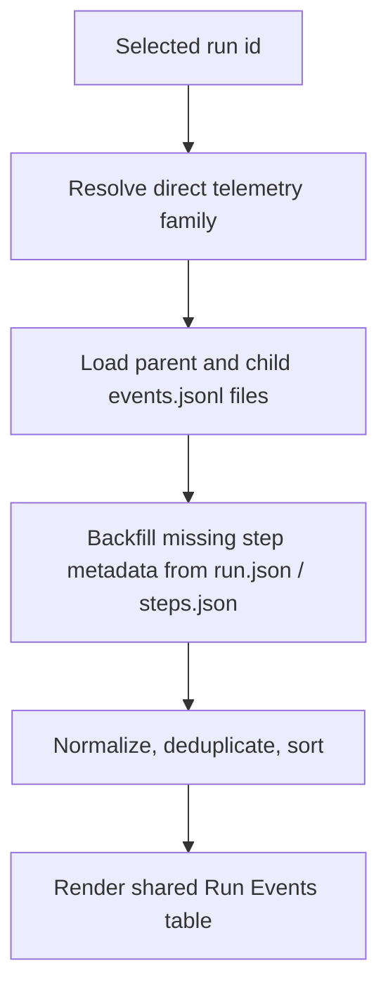

# FEAT: Run Event Telemetry Enrichment

* **ID:** FEAT_run_event_telemetry_enrichment
* **Status:** Approved
* **Owner/Area:** UI / Run Store
* **Last-Updated:** 2026-06-09
* **Related:** FEAT_plan_hub_runtime_progress_visibility, FEAT_crewai_event_listener_runtime_telemetry

---

## 1) Context / Problem

**Current behavior**

* Plan Hub, System Status, and System History render run telemetry through one shared table helper.
* Parent run-store events (`RUN_*`, `STEP_*`) often only persist `type` and `step_id`.
* Detailed CrewAI telemetry frequently exists only on child runs such as `..._week` or `..._phase_bundle`.

**Problem**

* UI tables often show empty `Flow`, `Step`, and `Details` cells even though the underlying run family contains enough information.
* Historical runs remain hard to inspect because the UI does not backfill missing step metadata from `steps.json`.

**Constraints**

* No schema change to run-store files.
* No new event types.
* No new parent-child persistence field in this patch.
* Merge logic must stay deterministic and limited to direct known child runs.

---

## 2) Goals & Non-Goals

**Goals**

* [x] Populate `flow`, `step`, and `details` for run telemetry tables from existing run-store data.
* [x] Merge direct child telemetry for selected planning runs.
* [x] Improve historical runs by deterministic backfill from `run.json` / `steps.json`.

**Non-Goals**

* [x] No new persisted `parent_run_id` model.
* [x] No page-specific telemetry implementations or toggles.

---

## 3) Proposed Behavior

**User/System behavior**

* Selecting a parent planning run shows both its own run-step lifecycle events and the relevant child flow/crew/task telemetry.
* Parent `STEP_*` rows become readable even for older runs because the loader backfills step labels and details from `steps.json`.
* Newly written worker events include richer context so future runs are readable without backfill.

**UI impact**

* UI affected: Yes
* If Yes: Plan Hub Run Events, System Status Flow / Crew Telemetry, and any other surface using the shared run event table.

### UI Flow (Mermaid)

**Non-UI behavior (if applicable)**

* Components involved: `rps.ui.run_store`, `rps.ui.shared`, `rps.orchestrator.plan_hub_worker`
* Contracts touched: run-store event payloads only

---

## 4) Implementation Analysis

**Components / Modules**

* `rps.ui.run_store`: add one enriched event loader and family resolution helpers.
* `rps.ui.shared`: switch the shared event table to enriched events.
* `rps.orchestrator.plan_hub_worker`: enrich parent `RUN_*` / `STEP_*` events at write time.

**Data flow**

* Inputs: selected run id, run-store `run.json`, `steps.json`, `events.jsonl`, direct child run event files.
* Processing: resolve run family, backfill missing step context, normalize fields, deduplicate, sort.
* Outputs: UI-ready event rows plus richer future event payloads in `events.jsonl`.

**Schema / Artefacts**

* New artefacts: none
* Changed artefacts: none
* Validator implications: existing run-store JSONL readers remain compatible

---

## 5) Impact Analysis (complete)

**Compatibility**

* Backward compatible: Yes
* Breaking changes: none
* Fallback behavior: if child run files are absent, render parent-only telemetry with step backfill where possible

**Conflicts with ADRs / Principles**

* Potential conflicts: none
* Resolution: runtime telemetry storage contract stays unchanged; only loading/enrichment changes

**Impacted areas**

* UI: populated event tables on Plan Hub / Status / History
* Pipeline/data: richer parent worker events
* Renderer: shared event table only
* Workspace/run-store: enriched load path for `events.jsonl`
* Validation/tooling: targeted test updates only
* Deployment/config: none

**Required refactoring**

* Centralize telemetry-family loading into one helper.
* Remove direct raw `load_events(...)` usage from the shared table path.

---

## 6) Options & Recommendation

### Option A — Merge parent + direct child telemetry

**Summary**

* Show one merged run-family view for selected planning runs.

**Pros**

* Exposes the actual Flow/Crew telemetry users expect.
* Works with current orchestrator run-id conventions.

**Cons**

* Requires deterministic family resolution logic.

**Risk**

* Duplicate rows if merge and dedupe are implemented poorly.

### Option B — Parent-only enrichment

**Summary**

* Improve only parent events and ignore child run telemetry.

**Pros**

* Simpler implementation.

**Cons**

* Still hides most CrewAI telemetry for scoped phase/week runs.

### Recommendation

* Choose: Option A
* Rationale: child runs already carry the runtime detail users want; parent-only enrichment would still leave the main observability gap open.

---

## 7) Acceptance Criteria (Definition of Done)

* [x] Shared event table loads enriched merged telemetry rather than raw parent-only events.
* [x] Historical parent `STEP_*` rows gain readable `step` and `details` from `steps.json` when available.
* [x] Future parent worker events persist `step`, `details`, `agent`, `writes`, and `authority`.
* [x] No duplicate event spam after merge.
* [x] Validation passes: `python3 -m py_compile`, targeted pytest, lint, typecheck.

---

## 8) Migration / Rollout

**Migration strategy**

* None. Historical runs are improved on read.

**Rollout / gating**

* Feature flag / config: none
* Safe rollback: revert to raw `load_events(...)` usage and previous event payloads

---

## 9) Risks & Failure Modes

* Failure mode: child telemetry family resolution includes unrelated runs
  * Detection: merged table shows unexpected child run events
  * Safe behavior: restrict discovery to direct prefix children with actual `events.jsonl`
  * Recovery: tighten the suffix/prefix filter

* Failure mode: malformed historical event rows still lack context
  * Detection: row remains `—`
  * Safe behavior: display fallback placeholders, do not crash the page
  * Recovery: inspect run-store files

---

## 10) Observability / Logging

**New/changed events**

* No new event types.
* Existing worker events gain richer optional fields (`step`, `details`, `agent`, `writes`, `authority`).

**Diagnostics**

* Debug logs for resolved telemetry family run ids and discovered/missing `events.jsonl` files.

---

## 11) Documentation Updates

Update these docs as part of implementation:

* [x] This feature doc
* [ ] `CHANGELOG.md` — user-visible telemetry enrichment once the change is released
