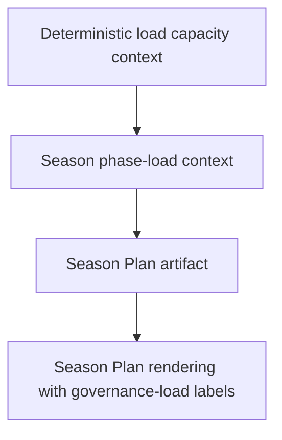

# FEAT: Season Load Capacity Semantics

* **ID:** FEAT_season_load_capacity_semantics
* **Status:** Implemented
* **Owner/Area:** Planning / Load Governance
* **Last-Updated:** 2026-05-19
* **Related:** `src/rps/planning/load_bands.py`, `specs/schemas/season_plan.schema.json`

---

## 1) Context / Problem

**Current behavior**

* Deterministic season load-capacity context computes `availability_load_capacity_kj.min|typical|max`.
* The current implementation uses the ceiling of the allowed intensity-domain set for every bucket and then infers the season baseline from `typical * 0.65`.
* Season Plan renders those bands as `weekly_kj`, which users naturally read as mechanical weekly kJ.

**Problem**

* The inferred season baseline and later build corridors are too aggressive for endurance-led season semantics.
* The Season Plan surface does not clearly state that the corridor is a governance load metric, not mechanical weekly work.

**Constraints**

* Keep the existing Season/Phase/Week artifact contracts structurally compatible.
* Do not rename schema fields in this change.
* Preserve deterministic code ownership of load corridor math.

---

## 2) Goals & Non-Goals

**Goals**

* [x] Derive `availability_load_capacity_kj.typical` from a representative weekly load assumption, not the hard domain ceiling.
* [x] Infer season baseline from a more plausible proportion of representative typical capacity.
* [x] Make Season Plan rendering and guidance explicitly describe these values as governance load.

**Non-Goals**

* [x] Do not redesign the full load-estimation model.
* [x] Do not rename persisted Season Plan schema keys in this pass.

---

## 3) Proposed Behavior

**User/System behavior**

* Season deterministic load capacity now exposes a representative `typical` value and a harder `max` ceiling.
* Inferred season baseline is lower and more plausible for endurance-led season plans.
* Season Plan rendering describes weekly load corridors as governance load rather than plain weekly kJ.

**UI impact**

* UI affected: Yes
* If Yes: Season Plan markdown/rendered labels become more explicit about governance load semantics.

### UI Flow (Mermaid)

**Non-UI behavior (if applicable)**

* Components involved: `load_bands`, season rendering templates, tests
* Contracts touched: deterministic context semantics only

---

## 4) Implementation Analysis

**Components / Modules**

* `src/rps/planning/load_bands.py`: representative capacity IF and baseline inference tuning
* `src/rps/rendering/templates/season_plan.md.j2`: explicit governance-load labels
* `src/rps/ui/shared.py`: matching label update
* `tests/test_load_bands.py`: regression coverage

**Data flow**

* Inputs: availability hours, FTP, allowed domains, IF reference
* Processing: representative capacity calculation, season baseline inference
* Outputs: lower deterministic typical capacity, lower season phase corridors, clearer rendered labels

**Schema / Artefacts**

* New artefacts: none
* Changed artefacts: season deterministic context values and Season Plan prose/labels
* Validator implications: none structural

---

## 5) Impact Analysis (complete)

**Compatibility**

* Backward compatible: Yes
* Breaking changes: none at schema level
* Fallback behavior: existing consumers still read the same field names

**Conflicts with ADRs / Principles**

* Potential conflicts: none
* Resolution: n/a

**Impacted areas**

* UI: clearer Season Plan load labels
* Pipeline/data: deterministic season capacity values shift downward
* Renderer: season template text updates
* Workspace/run-store: future season artifacts carry improved notes/values
* Validation/tooling: targeted load-band tests
* Deployment/config: none

**Required refactoring**

* Small helper extraction in `load_bands.py`

---

## 6) Options & Recommendation

### Option A — Representative typical capacity + current schema labels clarified

**Summary**

* Keep schema field names but fix the representative math and visible terminology.

**Pros**

* Low blast radius
* Reduces inflated build corridors
* Improves user interpretation immediately

**Cons**

* Schema keys still contain legacy `weekly_kj` naming

**Risk**

* Low

### Option B — Full schema rename to governance-load terminology

**Summary**

* Rename Season/Phase/Week load fields across artifacts and UIs.

**Pros**

* Fully correct semantics

**Cons**

* Large contract migration
* Higher regression risk

### Recommendation

* Choose: Option A
* Rationale: fixes the current planning distortion with minimal contract churn.

---

## 7) Acceptance Criteria (Definition of Done)

* [x] Season deterministic typical capacity is lower than the hard max ceiling when broad domains are allowed.
* [x] Inferred season baseline no longer derives from the hard ceiling.
* [x] Season Plan rendering labels these values as governance load.
* [x] Validation passes: syntax, lint, typecheck, targeted tests

---

## 8) Migration / Rollout

**Migration strategy**

* No schema migration; newly generated season artifacts simply use improved deterministic values and clearer notes.

**Rollout / gating**

* Feature flag / config: none
* Safe rollback: revert deterministic helper changes

---

## 9) Risks & Failure Modes

* Failure mode: inferred season corridors become too conservative
  * Detection: targeted regression tests and season artifact review
  * Safe behavior: planning still remains within deterministic bounds
  * Recovery: tune representative IF / baseline factor

---

## 10) Observability / Logging

**New/changed events**

* No new events

**Diagnostics**

* Deterministic load-capacity context block
* Deterministic season phase-load context block

---

## 11) Documentation Updates

Update these docs as part of implementation:

* [x] `CHANGELOG.md` — note representative season capacity and governance-load labeling

---

## 12) Link Map (no duplication; links only)

* Architecture: `doc/architecture/system_architecture.md`
* Artefact flow: `doc/overview/artefact_flow.md`
* Load estimation spec: `specs/knowledge/_shared/sources/specs/load_estimation_spec.md`
