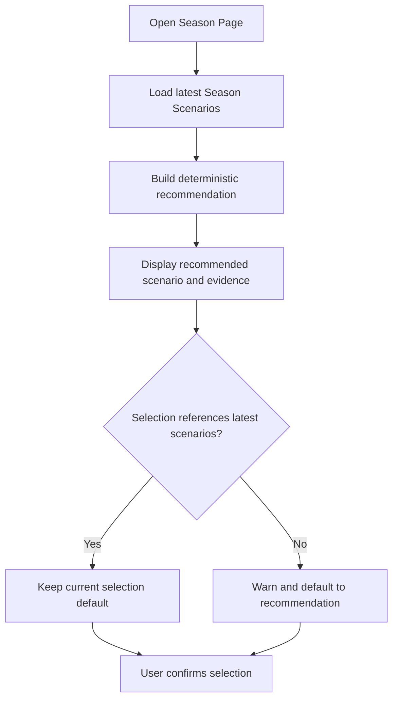

# FEAT: Season Scenario Recommendation

* **ID:** FEAT_season_scenario_recommendation
* **Status:** Implemented
* **Owner/Area:** Planning
* **Last-Updated:** 2026-05-19
* **Related:** FEAT_planning_chain_contract_hardening, FEAT_season_scenarios_deterministic_horizon

---

## 1) Context / Problem

**Current behavior**

* Season Scenarios are generated as three advisory alternatives.
* The Season page lets the user select `A|B|C`, but does not surface a data-backed recommendation.
* Scenario letters are not stable semantics across regenerations; a stale `SEASON_SCENARIO_SELECTION` can point to a different scenario after scenarios are regenerated.

**Problem**

* Users must manually compare scenarios against historical load, recent trends, goals, availability, events, and athlete profile.
* A stale selection can silently carry the wrong scenario semantics into Season Plan generation.

**Constraints**

* No persisted schema change in v1.
* Scenario selection remains user-confirmed.
* Recommendation is advisory and must not override deterministic contracts or user selection.

---

## 2) Goals & Non-Goals

**Goals**

* [x] Compute a deterministic scenario recommendation from available runtime artefacts.
* [x] Inject recommendation context into Season Scenario generation so the task can explain the choice.
* [x] Show the recommendation on the Season Scenario selection page.
* [x] Warn when latest selection references an older scenario set.

**Non-Goals**

* [x] No new persisted artefact or schema field.
* [x] No automatic scenario selection without user confirmation.

---

## 3) Proposed Behavior

**User/System behavior**

* After scenarios exist, the Season page displays a recommended scenario, confidence, key evidence, and ranked alternatives.
* The scenario radio defaults to the recommendation when there is no current selection or the current selection references an older scenario set.
* If a selection references an older scenario set, the UI warns that scenario letters may have changed.

**UI impact**

* UI affected: Yes
* Page: Plan → Season

### UI Flow (Mermaid)

**Non-UI behavior**

* Components involved: `rps.planning.scenario_recommendation`, `season_flow`, `Plan → Season`.
* Contracts touched: `SEASON_SCENARIOS` remains schema-compatible; recommendation is advisory context.

---

## 4) Implementation Analysis

**Components / Modules**

* `src/rps/planning/scenario_recommendation.py`: deterministic recommendation scoring and markdown rendering.
* `src/rps/orchestrator/season_flow.py`: inject recommendation context into `season_scenarios` task.
* `src/rps/ui/pages/plan/season.py`: render recommendation and stale-selection warning.
* `skills/season/scenario-generation/SKILL.md`: instruct the scenario task to preserve recommendation evidence in notes/decision notes.

**Data flow**

* Inputs: `SEASON_SCENARIOS`, `ATHLETE_PROFILE`, `KPI_PROFILE`, `AVAILABILITY`, `PLANNING_EVENTS`, `HISTORICAL_BASELINE`, `ACTIVITIES_TREND`, `WELLNESS`.
* Processing: score each scenario by cadence and current athlete context.
* Outputs: advisory UI context and injected prompt block; no new persisted schema field.

**Schema / Artefacts**

* New artefacts: none.
* Changed artefacts: none.
* Validator implications: `SEASON_SCENARIOS` schema remains unchanged.

---

## 5) Impact Analysis

**Compatibility**

* Backward compatible: Yes.
* Breaking changes: None.
* Fallback behavior: missing trend/baseline data lowers confidence and shows available evidence only.

**Conflicts with ADRs / Principles**

* None. This follows deterministic contract priority: code derives recommendation facts; LLM only explains them.

**Impacted areas**

* UI: Season page recommendation panel.
* Pipeline/data: no change.
* Renderer: no change.
* Workspace/run-store: no change.
* Validation/tooling: unit tests for recommendation scoring.
* Deployment/config: no new config.

**Required refactoring**

* Isolate recommendation scoring from UI and prompts.

---

## 6) Options & Recommendation

### Option A — Deterministic recommendation injected into existing scenario task

**Summary**

* Compute recommendation in code and inject/render it without schema changes.

**Pros**

* Stable, testable, no migration.
* Avoids adding another persisted advisory artefact.

**Cons**

* Recommendation is not a first-class stored field.

### Option B — New persisted recommendation artefact

**Summary**

* Create a separate `SEASON_SCENARIO_RECOMMENDATION` artefact.

**Pros**

* Strong traceability.

**Cons**

* Requires schema/workspace/UI/store changes.

### Recommendation

* Choose: Option A.
* Rationale: It solves the immediate user workflow while preserving v1 schema stability.

---

## 7) Acceptance Criteria

* [x] Recommendation uses scenario cadence, historical baseline, trends, availability, events, KPI, and athlete profile where available.
* [x] Season scenario task receives recommendation context.
* [x] Season page displays the recommendation and evidence.
* [x] Stale scenario selection is detected and warned.
* [x] Validation passes: syntax, lint, typecheck, and targeted tests.

---

## 8) Migration / Rollout

**Migration strategy**

* None. Existing scenarios and selections remain readable.

**Rollout / gating**

* No feature flag.
* Safe rollback: remove UI panel and prompt injection; persisted artefacts remain unchanged.

---

## 9) Risks & Failure Modes

* Failure mode: missing trend data.
  * Detection: confidence is low and evidence warns.
  * Safe behavior: user can still select manually.
* Failure mode: stale selection.
  * Detection: selection trace does not match latest scenario run/version.
  * Safe behavior: UI warns and defaults to recommendation.

---

## 10) Observability / Logging

**New/changed events**

* No new run-store event in v1.

**Diagnostics**

* Inspect latest `SEASON_SCENARIOS`, `SEASON_SCENARIO_SELECTION`, and UI-rendered recommendation.

---

## 11) Documentation Updates

* [x] This feature doc records the behavior.
* [x] Scenario generation skill updated to consume recommendation context.

---

## 12) Link Map

* `doc/specs/features/FEAT_planning_chain_contract_hardening.md`
* `doc/specs/features/FEAT_season_scenarios_deterministic_horizon.md`
* `doc/overview/artefact_flow.md`
* `doc/architecture/agents.md`
