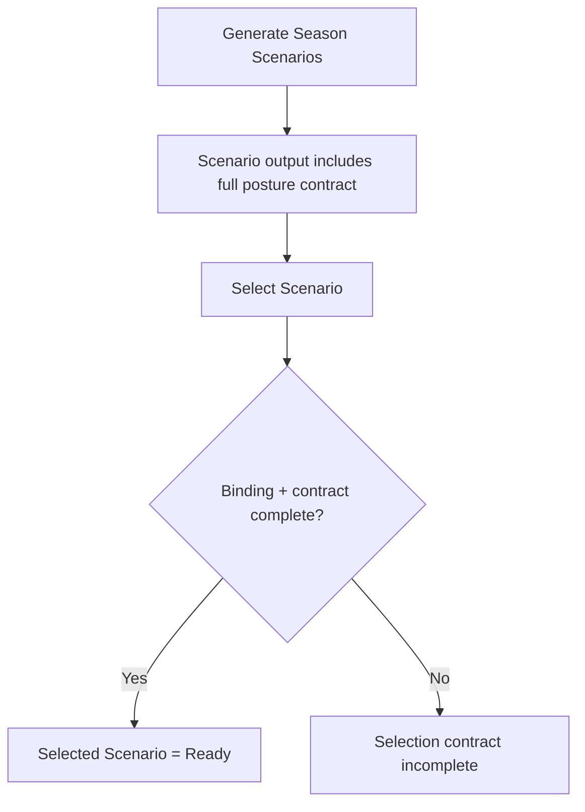

# FEAT: Season Scenarios Complete Selection Contract

* **ID:** FEAT_season_scenarios_complete_selection_contract
* **Status:** Approved
* **Owner/Area:** Planning Runtime
* **Last-Updated:** 2026-05-28
* **Related:** [FEAT_selected_scenario_contract_chain](/Users/alexander/RPS/doc/specs/features/FEAT_selected_scenario_contract_chain.md), [FEAT_strict_season_selection_binding](/Users/alexander/RPS/doc/specs/features/FEAT_strict_season_selection_binding.md)

---

## 1) Context / Problem

**Current behavior**

* `SEASON_SCENARIOS` is fresh and correctly bound to `SEASON_SCENARIO_SELECTION`.
* The downstream binding resolver now blocks `SEASON_PLAN` when the selected scenario contract is incomplete.
* Current `SEASON_SCENARIOS` outputs still omit required operational posture fields and serialize some required fields in shapes that downstream extraction currently misreads.

**Problem**

* Scenario generation does not emit a complete canonical operational posture contract for every scenario.
* `build_selected_scenario_contract_context(...)` still treats some structured guidance fields as scalars.
* UI/runtime can now correctly detect the defect, but the upstream producer does not yet satisfy the stricter contract.

**Constraints**

* Strict latest-selection binding remains unchanged.
* `scenario_guidance` is the authoritative producer-owned location for operational scenario posture.
* Active scenario-generation files must be front-loaded and self-contained per repo rules.
* Downstream Season/Phase/Week layers must not reconstruct missing scenario posture from prose.

---

## 2) Goals & Non-Goals

**Goals**

* [ ] Make `SEASON_SCENARIOS.data.scenarios[].scenario_guidance` a complete source for selected-scenario operational posture.
* [ ] Align schema, knowledge specs, active producer files, normalization, guardrails, extraction, and readiness to one canonical field shape.
* [ ] Preserve strict selection-binding behavior while removing false incomplete-contract failures for fresh valid scenarios.

**Non-Goals**

* [ ] No relaxation of stale-selection semantics.
* [ ] No new artifact type.
* [ ] No Phase/Week schema redesign in this change.

---

## 3) Proposed Behavior

**User/System behavior**

* Freshly generated Season Scenarios always contain the posture fields needed for a valid selection contract.
* The selected scenario contract is derived without scalar/list ambiguity.
* Scenario-generation defects fail at scenario validation/readiness, not later in Season planning.

**UI impact**

* UI affected: Yes
* If Yes: `Plan -> Season` and `Plan -> Hub` selection readiness messaging

### UI Flow (Mermaid)

**Non-UI behavior**

* Components involved: season scenario schema/specs, active scenario-generation files, normalization, runtime guardrails, contract extraction, readiness, snapshots, rendering
* Contracts touched: `SEASON_SCENARIOS`, `selected_scenario_contract`

---

## 4) Implementation Analysis

**Components / Modules**

* `specs/schemas/season_scenarios.schema.json`: require new posture fields and canonical shapes
* `skills/season/scenario-generation/SKILL.md`, `prompts/agents/season_scenario.md`, `config/crewai/tasks.yaml`: front-loaded and self-contained producer contract
* `src/rps/agents/output_normalization.py`: preserve required guidance keys and canonicalize list/string shapes
* `src/rps/crewai_runtime/guardrails.py`: add completeness guardrail for scenario contract posture
* `src/rps/planning/season_structure.py` and `src/rps/planning/season_selection_binding.py`: preserve canonical types and validate them correctly

**Data flow**

* Inputs: latest scenario-generation output
* Processing: normalize -> validate -> store -> bind -> extract selected scenario contract
* Outputs: complete `SEASON_SCENARIOS`, complete `selected_scenario_contract`, stable readiness outcome

**Schema / Artefacts**

* New artefacts: none
* Changed artefacts:
  * `SEASON_SCENARIOS`
  * derived `selected_scenario_contract` internal shape
* Validator implications:
  * `SEASON_SCENARIOS` now requires operational posture fields in `scenario_guidance`
  * selected-scenario contract extraction validates canonical list-vs-string types

---

## 5) Impact Analysis (complete)

**Compatibility**

* Backward compatible: No
* Breaking changes: older `SEASON_SCENARIOS` artifacts without required posture fields will fail completeness/readiness until regenerated
* Fallback behavior: none for current planning-ready outputs; regenerate scenarios

**Conflicts with ADRs / Principles**

* Potential conflicts: none identified
* Resolution: aligns with active planning-layer rule, front-loading rule, self-contained active-file rule, and variable-authority rule

**Impacted areas**

* UI: selection readiness and error attribution
* Pipeline/data: scenario generation -> selection contract derivation
* Renderer: selected scenario contract block formatting for structured list fields
* Workspace/run-store: stronger scenario readiness semantics
* Validation/tooling: schema, generated models, normalization, runtime guardrails
* Deployment/config: none

**Required refactoring**

* Separate scalar-vs-list extraction behavior in selected scenario contract builder
* Centralize producer-side completeness checks in real runtime guardrail hooks

---

## 6) Options & Recommendation

### Option A — Canonical typed posture contract in `scenario_guidance`

**Summary**

* Require scenario guidance to emit the full operational posture and preserve exact types downstream.

**Pros**

* Clean authority boundary
* No prose inference downstream
* Stable readiness semantics

**Cons**

* Requires coordinated schema/spec/fixture updates

**Risk**

* Existing test fixtures and old artifacts need regeneration or adjustment

### Option B — Keep upstream loose and relax downstream checks

**Summary**

* Allow selection contract derivation to infer posture from narrative fields.

**Pros**

* Smaller change

**Cons**

* Violates front-loading/self-contained rules
* Reintroduces planner-side ambiguity and drift

### Recommendation

* Choose: Option A
* Rationale: the repo rules explicitly require active-layer front-loading and self-contained authority for operational planning semantics

---

## 7) Acceptance Criteria (Definition of Done)

* [ ] `SEASON_SCENARIOS` schema requires `recovery_margin`, `fatigue_exposure`, and `specificity_density` in `scenario_guidance`.
* [ ] `constraint_summary`, `event_alignment_notes`, `risk_flags`, `kpi_guardrail_notes`, and `decision_notes` are treated canonically as string arrays.
* [ ] Active scenario-generation files define the posture fields locally and require direct serialization rather than prose inference.
* [ ] Runtime guardrails reject scenario outputs that are missing the required operational posture.
* [ ] `build_selected_scenario_contract_context(...)` preserves strings as strings and list fields as lists.
* [ ] Readiness reports incomplete current scenario payloads accurately and does not misclassify fresh valid scenarios.
* [ ] Validation passes: `python3 -m py_compile $(git ls-files '*.py')`, `python3 scripts/check_schema_required.py`, `python3 scripts/bundle_schemas.py`, `./scripts/run_lint.sh`, `./scripts/run_typecheck.sh`, targeted `pytest`
* [ ] No regressions in Season Scenario -> Selection -> Season Plan startup flow.

---

## 8) Migration / Rollout

**Migration strategy**

* Regenerate bundled schemas and generated artifact models after schema updates.
* Regenerate existing Season Scenarios through the normal planning flow before they are considered planning-ready.

**Rollout / gating**

* Feature flag / config: none
* Safe rollback: revert schema/spec, producer guidance, normalization/guardrails, and contract extraction together

---

## 9) Risks & Failure Modes

* Failure mode: scenario generation omits required posture fields
  * Detection: `SEASON_SCENARIOS` completeness guardrail / schema validation
  * Safe behavior: scenario artifact is rejected or marked incomplete before downstream planning use
  * Recovery: rerun season scenarios after fixing producer output

* Failure mode: array-shaped fields collapse to scalar empties during extraction
  * Detection: selected-scenario contract completeness failure, extraction tests
  * Safe behavior: selection remains blocked
  * Recovery: fix extraction mapping and rerun

---

## 10) Observability / Logging

**New/changed events**

* `season_scenarios_contract_incomplete`: emitted when scenario posture is missing required operational fields
* selection-binding readiness errors should continue surfacing exact missing field names

**Diagnostics**

* runtime logs
* readiness messages on Plan Hub / Plan Season
* scenario guardrail failures in run history

---

## 11) Documentation Updates

* [ ] [specs/knowledge/_shared/sources/specs/mandatory_output_season_scenarios.md](/Users/alexander/RPS/specs/knowledge/_shared/sources/specs/mandatory_output_season_scenarios.md) — require the canonical scenario posture fields and types
* [ ] [specs/knowledge/_shared/sources/specs/season_scenarios_interface_spec.md](/Users/alexander/RPS/specs/knowledge/_shared/sources/specs/season_scenarios_interface_spec.md) — align interface wording with canonical shapes
* [ ] [specs/knowledge/_shared/sources/contracts/scenario__season_contract.md](/Users/alexander/RPS/specs/knowledge/_shared/sources/contracts/scenario__season_contract.md) — clarify advisory producer responsibilities vs canonical posture emission
* [ ] [CHANGELOG.md](/Users/alexander/RPS/CHANGELOG.md) — record complete scenario contract hardening
* [ ] [doc/overview/feature_backlog.md](/Users/alexander/RPS/doc/overview/feature_backlog.md) — record feature completion
