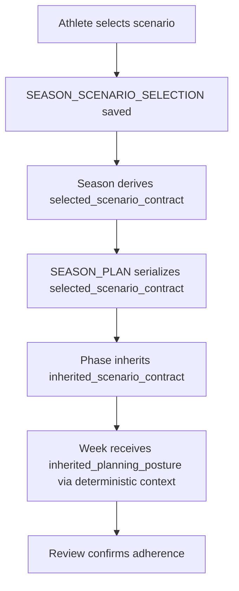

# FEAT: Selected Scenario Contract Chain

* **ID:** FEAT_selected_scenario_contract_chain
* **Status:** Approved
* **Owner/Area:** Planning Runtime
* **Last-Updated:** 2026-05-28
* **Related:** [FEAT_planner_positive_frontloading_rollout](/Users/alexander/RPS/doc/specs/features/FEAT_planner_positive_frontloading_rollout.md)

---

## 1) Context / Problem

**Current behavior**

* The athlete chooses a scenario through `SEASON_SCENARIO_SELECTION`.
* Season planning reads `SEASON_SCENARIOS` plus `SEASON_SCENARIO_SELECTION`.
* Downstream planning already inherits cadence, domains, and some archetype semantics through deterministic context.

**Problem**

* The chosen scenario posture is reduced too aggressively to cadence, domains, and archetype.
* Phase and Week inherit only a thin subset of the user-selected scenario meaning.
* Snapshots, contract tools, active files, validation, and renderer surfaces do not consistently carry the same selected-scenario posture semantics.

**Constraints**

* The athlete remains the sole selector of A/B/C.
* Season is the only layer allowed to bind the raw selection directly.
* Phase and Week must inherit the resulting posture only through upstream contracts and deterministic context.
* Review remains formal and writer remains serialization-only.

---

## 2) Goals & Non-Goals

**Goals**

* [ ] Introduce one code-owned selected-scenario contract derived from `SEASON_SCENARIOS` + `SEASON_SCENARIO_SELECTION`.
* [ ] Propagate this contract through Season -> Phase -> Week artifacts, deterministic context, snapshots, tools, and active files.
* [ ] Validate and enforce contract consistency in normalization, planning contracts, guardrails, and guarded store.

**Non-Goals**

* [ ] Introduce an automatic selector that chooses A/B/C.
* [ ] Add a new serialized scenario contract block to `WEEK_PLAN` in this change.

---

## 3) Proposed Behavior

**User/System behavior**

* The athlete continues to select the scenario manually.
* Season planning derives a code-owned `selected_scenario_contract` from the chosen scenario and treats it as binding planning posture.
* Phase planning inherits that posture from `SEASON_PLAN`.
* Week planning inherits a narrowed `inherited_planning_posture` from Phase deterministic context.
* Coach and advisory memory may summarize the chosen posture narratively, but remain non-binding.

**UI impact**

* UI affected: Yes
* Season and Phase rendered outputs show compact selected/inherited scenario posture summaries.
* Week does not render a separate scenario contract block.

### UI Flow (Mermaid)

**Non-UI behavior (if applicable)**

* Components involved: schemas, deterministic context builders, workspace read tools, snapshots, planning validators, guarded store, renderer, active planning files.
* Contracts touched: `SEASON_PLAN`, `PHASE_GUARDRAILS`, `PHASE_STRUCTURE`, deterministic contract tool payloads, snapshot prompt blocks.

---

## 4) Implementation Analysis

**Components / Modules**

* `season_structure.py`: derive a new selected-scenario contract object.
* `deterministic_context.py`: expose the new contract separately from structure context.
* `workspace_read_tools.py`: return nested selected/inherited posture blocks through existing contract tools.
* `context_snapshots.py`: persist authoritative snapshot prompt blocks plus advisory summaries.
* planning/runtime validation layers: enforce consistency of the new contract chain.
* active prompts / tasks / skills: frontload what posture is received and what must be preserved.

**Data flow**

* Inputs: `SEASON_SCENARIOS`, `SEASON_SCENARIO_SELECTION`, `SEASON_PLAN`, `PHASE_GUARDRAILS`, `PHASE_STRUCTURE`.
* Processing: derive contract once in Season; serialize into Season artifact; narrow and propagate into Phase artifacts and Week deterministic context.
* Outputs: updated artifacts, updated snapshot prompt blocks, updated tool payloads, updated rendered summaries.

**Schema / Artefacts**

* New artifacts: none.
* Changed artifacts:
  * `SEASON_PLAN`
  * `PHASE_GUARDRAILS`
  * `PHASE_STRUCTURE`
* Validator implications:
  * derived selected-scenario contract must match Season serialization
  * Phase inherited contract must match the shared subset from Season

---

## 5) Impact Analysis (complete)

**Compatibility**

* Backward compatible: No, schema updates require regenerated artifact models and stricter validations.
* Breaking changes: older artifacts without the new contract fields will fail strict validation in affected flows until regenerated.
* Fallback behavior: none for new writes; legacy artifacts remain readable where strict write validation is not invoked.

**Conflicts with ADRs / Principles**

* Potential conflicts: none identified.
* Resolution: aligns with active planning-layer rule and source-first planner guidance.

**Impacted areas**

* UI: rendered Season/Phase summaries and Coach/advisory summaries.
* Pipeline/data: Season -> Phase -> Week contract propagation.
* Renderer: compact contract summaries for Season and Phase.
* Workspace/run-store: contract tool payloads and snapshot prompt blocks.
* Validation/tooling: schema-required checks, generated artifact models, planning contracts, guarded store, runtime guardrails.
* Deployment/config: none.

**Required refactoring**

* Separate selected-scenario structure context from selected-scenario contract context.
* Centralize contract field derivation so snapshots, tools, and validators consume the same source.

---

## 6) Options & Recommendation

### Option A — Dedicated selected-scenario contract builder

**Summary**

* Add a new builder and keep structure-only context separate.

**Pros**

* Clear ownership boundary.
* Avoids overloading existing structure-only context.
* Makes downstream validation simpler.

**Cons**

* More touch points across the runtime chain.

**Risk**

* Requires coordinated schema, snapshot, tool, and validator updates.

### Option B — Expand existing structure context only

**Summary**

* Add posture fields directly to the existing `selected_scenario_structure_context`.

**Pros**

* Fewer new names.

**Cons**

* Blurs structure vs posture semantics.
* Increases risk of partial reuse and future drift.

### Recommendation

* Choose: Option A
* Rationale: structure math and selected planning posture are distinct authorities and should not be mixed.

---

## 7) Acceptance Criteria (Definition of Done)

* [ ] `SEASON_PLAN` requires and serializes `selected_scenario_contract`.
* [ ] `PHASE_GUARDRAILS` and `PHASE_STRUCTURE` require and serialize `inherited_scenario_contract`.
* [ ] Deterministic context tools expose nested selected/inherited posture blocks exactly as specified.
* [ ] Athlete/planning snapshots include authoritative posture prompt blocks.
* [ ] Advisory memory includes only narrative posture summaries.
* [ ] Active Season / Phase / Week prompts, tasks, and skills positively describe received posture and preservation duties.
* [ ] Validation passes: `python3 -m py_compile $(git ls-files '*.py')`, `python3 scripts/check_schema_required.py`, `python3 scripts/generate_artifact_models.py`, `./scripts/run_lint.sh`, `./scripts/run_typecheck.sh`, targeted `pytest`.
* [ ] No regressions in Season -> Phase -> Week planning contract enforcement.

---

## 8) Migration / Rollout

**Migration strategy**

* Regenerate artifact models after schema changes.
* Existing latest artifacts may need regeneration through normal planning flows before strict downstream write paths succeed.

**Rollout / gating**

* Feature flag / config: none
* Safe rollback: revert schema changes and contract-builder/tool/snapshot changes together.

---

## 9) Risks & Failure Modes

* Failure mode: selected-scenario contract derived inconsistently across layers.

  * Detection: contract validation failures, guarded-store rejection, snapshot/tool test failures.
  * Safe behavior: block the write or review path rather than silently soften the posture.
  * Recovery: regenerate Season/Phase artifacts after fixing the derivation chain.

* Failure mode: advisory memory treated as authority.

  * Detection: active-file audit/tests or Coach regression tests.
  * Safe behavior: keep advisory memory explicitly non-binding.
  * Recovery: remove or tighten summary wording.

---

## 10) Observability / Logging

**New/changed events**

* No new telemetry event family required.
* Existing validation/store failures should include whether selected/inherited scenario contract mismatch caused the block.

**Diagnostics**

* Check planning contract tests, guarded store write errors, runtime validation errors, and snapshot prompt blocks.

---

## 11) Documentation Updates

Update these docs as part of implementation:

* [ ] [doc/overview/artefact_flow.md](/Users/alexander/RPS/doc/overview/artefact_flow.md) — document selected/inherited scenario contract flow.
* [ ] [doc/architecture/system_architecture.md](/Users/alexander/RPS/doc/architecture/system_architecture.md) — note Season-only binding of user scenario selection.
* [ ] [doc/overview/feature_backlog.md](/Users/alexander/RPS/doc/overview/feature_backlog.md) — record completion.
* [ ] [CHANGELOG.md](/Users/alexander/RPS/CHANGELOG.md) — summarize runtime and contract changes.
