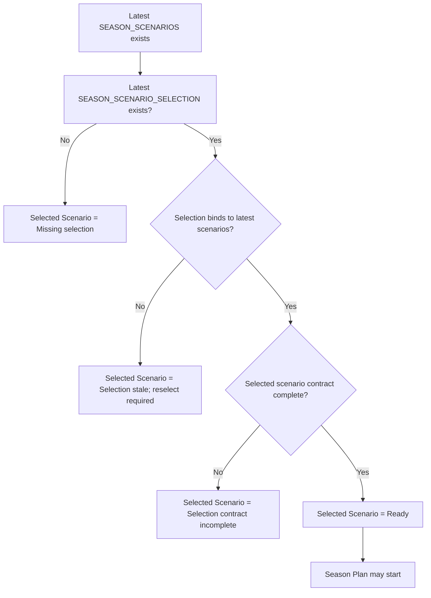

# FEAT: Strict Season Scenario Selection Binding

* **ID:** FEAT_strict_season_selection_binding
* **Status:** Approved
* **Owner/Area:** Planning Runtime
* **Last-Updated:** 2026-05-28
* **Related:** [FEAT_selected_scenario_contract_chain](/doc/specs/features/FEAT_selected_scenario_contract_chain.md)

---

## 1) Context / Problem

**Current behavior**

* UI can mark `SEASON_SCENARIO_SELECTION` ready when a latest selection artifact exists and loosely references the latest scenarios.
* `SEASON_PLAN` runtime derives the selected scenario structure/contract later and may fail inside finalize or normalized contract validation.

**Problem**

* Readiness and runtime do not share one binding truth source.
* A stale or weakly referenced selection can appear ready in UI but still fail inside `SEASON_PLAN`.
* Failures occur too late, after season planning tasks already started.

**Constraints**

* No public schema change is required.
* Binding must be strict: a selection is valid only for the exact latest `SEASON_SCENARIOS` version it references.
* Season-only active-file hardening is in scope; Phase/Week contract changes are not.

---

## 2) Goals & Non-Goals

**Goals**

* [x] Make selection binding a hard prerequisite for `SEASON_PLAN`.
* [x] Use one reusable binding resolver across UI, worker, runtime, and snapshots.
* [x] Fail before any Season planning crew task starts when binding is invalid.
* [x] Tighten Season finalize/review/writer handling of `selected_scenario_contract`.

**Non-Goals**

* [x] No Phase/Week schema or contract expansion in this change.
* [x] No permissive fallback that silently reuses an older selection against newer scenarios.

---

## 3) Proposed Behavior

**User/System behavior**

* A scenario selection remains valid only while it points to the current latest `SEASON_SCENARIOS`.
* Writing a new `SEASON_SCENARIOS` artifact invalidates any earlier selection.
* UI and runtime show the same binding verdict.
* `SEASON_PLAN` aborts before planning if binding or contract derivation fails.

**UI impact**

* UI affected: Yes
* If Yes: `Plan -> Season` and `Plan -> Hub` readiness/status

### UI Flow (Mermaid)

**Non-UI behavior**

* Components involved: season selection binding resolver, season flow preflight, Plan Hub readiness, snapshots, Season prompts/skills/tasks
* Contracts touched: internal selected-scenario binding result, Season preflight checks

---

## 4) Implementation Analysis

**Components / Modules**

* `src/rps/planning/season_selection_binding.py`: new canonical resolver and readiness mapping
* `src/rps/orchestrator/season_flow.py`: season preflight and early abort
* `src/rps/ui/pages/plan/hub.py`, `src/rps/ui/pages/plan/season.py`: reuse binding resolver for readiness/status
* `src/rps/orchestrator/context_snapshots.py`: include authoritative selected-scenario contract block only when binding succeeds
* Season prompts/tasks/skills: selected-scenario-contract hardening

**Data flow**

* Inputs: latest `SEASON_SCENARIOS`, latest `SEASON_SCENARIO_SELECTION`
* Processing: strict binding resolution -> contract/structure derivation -> readiness/preflight decision
* Outputs: readiness state, early blocking errors, selected scenario contract only when binding succeeds

**Schema / Artefacts**

* New artefacts: none
* Changed artefacts: none
* Validator implications: Season preflight now blocks before crew start; normalized exact-match remains as final safety net

---

## 5) Impact Analysis (complete)

**Compatibility**

* Backward compatible: No, intentionally stricter runtime semantics
* Breaking changes: older selections that reference stale scenarios or use non-binding refs become invalid
* Fallback behavior: none; reselection is required

**Conflicts with ADRs / Principles**

* Potential conflicts: none identified
* Resolution: aligns with code-owned authority and active planning-layer rules

**Impacted areas**

* UI: readiness/status for Selected Scenario and Season Plan
* Pipeline/data: none
* Renderer: none
* Workspace/run-store: selection binding becomes stricter, but no storage format change required
* Validation/tooling: new binding resolver tests and early-abort tests
* Deployment/config: none

**Required refactoring**

* Remove duplicate UI-only season selection matching logic
* Centralize readiness/binding mapping on one resolver

---

## 6) Options & Recommendation

### Option A — Strict binding resolver (recommended)

**Summary**

* One canonical resolver validates selection against latest scenarios using exact reference precedence and derives selected scenario contract/structure before Season planning starts.

**Pros**

* UI/runtime consistency
* Early failure
* Clear stale-selection semantics

**Cons**

* Older loose selections become invalid

**Risk**

* Some test fixtures and manual workflows need reselection updates

### Option B — Keep loose readiness and rely on runtime normalization

**Summary**

* Allow UI readiness to stay heuristic and keep late contract failures as-is.

**Pros**

* Smaller change

**Cons**

* Keeps current false-ready state
* Fails late and opaquely

### Recommendation

* Choose: Option A
* Rationale: the defect is a binding/readiness inconsistency; only a single strict resolver removes it cleanly

---

## 7) Acceptance Criteria (Definition of Done)

* [ ] New `SEASON_SCENARIOS` invalidates older latest selection immediately in UI readiness.
* [ ] `SEASON_PLAN` cannot start unless latest selection binds to latest scenarios and yields a complete `selected_scenario_contract`.
* [ ] No season planning crew task is prepared when binding fails.
* [ ] `ATHLETE_STATE_SNAPSHOT` only carries authoritative selected scenario contract block when binding succeeds.
* [ ] Season finalize/review/writer active files explicitly treat `selected_scenario_contract` as binding and fail closed when it is incomplete.
* [ ] Validation passes: `python3 -m py_compile $(git ls-files '*.py')`, `./scripts/run_lint.sh`, `./scripts/run_typecheck.sh`, targeted `pytest`
* [ ] No regressions in Season scenarios selection and season-plan startup flows.

---

## 8) Migration / Rollout

**Migration strategy**

* No schema migration
* Existing stale selections are treated as invalid and require reselection

**Rollout / gating**

* No feature flag
* Safe rollback: revert resolver enforcement and readiness wiring

---

## 9) Risks & Failure Modes

* Failure mode: selection artifact exists but no longer binds to latest scenarios
  * Detection: resolver `reason_code=selection_stale_vs_scenarios`
  * Safe behavior: block `SEASON_PLAN`, show reselection-required status
  * Recovery: user reselects scenario

* Failure mode: selected scenario contract derivation is incomplete
  * Detection: resolver `reason_code=selected_scenario_contract_incomplete`
  * Safe behavior: block `SEASON_PLAN` before crew start
  * Recovery: fix scenario-selection/scenario-content contract source

---

## 10) Observability / Logging

**New/changed events**

* `selected_scenario_binding_failed`: emitted when season-plan startup binding fails
* existing season-plan failures should now include structured `reason_code`

**Diagnostics**

* runtime logs
* run-store error payloads
* Plan Hub readiness reason strings

---

## 11) Documentation Updates

* [ ] [doc/overview/artefact_flow.md](/doc/overview/artefact_flow.md) — clarify strict reselection semantics after new scenarios
* [ ] [doc/overview/how_to_plan.md](/doc/overview/how_to_plan.md) — note that Season Plan requires a fresh selection bound to latest scenarios
* [ ] [CHANGELOG.md](/CHANGELOG.md) — record strict selection binding enforcement

---

## 12) Link Map (no duplication; links only)

* Architecture: [doc/architecture/system_architecture.md](/doc/architecture/system_architecture.md)
* Workspace: [doc/architecture/workspace.md](/doc/architecture/workspace.md)
* Artefact flow: [doc/overview/artefact_flow.md](/doc/overview/artefact_flow.md)
* Planning flow: [doc/overview/how_to_plan.md](/doc/overview/how_to_plan.md)
* Existing contract chain feature: [doc/specs/features/FEAT_selected_scenario_contract_chain.md](/doc/specs/features/FEAT_selected_scenario_contract_chain.md)
