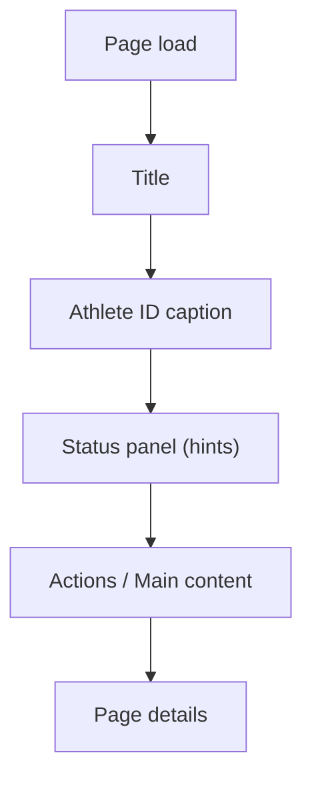

# FEAT: UI Page Layout Consistency

* **ID:** FEAT_ui_page_layout_consistency
* **Status:** Implemented
* **Owner/Area:** UI
* **Last-Updated:** 2026-02-10
* **Related:** N/A

---

## 1) Context / Problem

**Current behavior**

* Page headers, athlete context, and status hints appear in different orders across pages.
* Some pages render status hints later in the page, making it harder to scan.

**Problem**

* Inconsistent layout hierarchy reduces scan-ability and makes navigation feel uneven.

**Constraints**

* No new dependencies.
* Preserve existing page functionality and data flows.

---

## 2) Goals & Non-Goals

**Goals**

* [x] Standardize page layout order: **Title → Athlete ID → Status/Hint panel → Actions/Content**.
* [x] Ensure status panel renders once per page.

**Non-Goals**

* [ ] Changing page-specific business logic.
* [ ] Modifying schemas or orchestrator behavior.

---

## 3) Proposed Behavior

**User/System behavior**

* All pages render the title, athlete caption, and the status panel before any actions or main content.

**UI impact**

* UI affected: Yes
* Affected pages: all Streamlit pages under `src/rps/ui/pages/*`.

### UI Flow (Mermaid)

**Non-UI behavior (if applicable)**

* Components involved: none
* Contracts touched: none

---

## 4) Implementation Analysis

**Components / Modules**

* `src/rps/ui/pages/*`: reorder status panel and add missing status initialization.

**Data flow**

* Inputs: existing session state
* Processing: `set_status` + `render_status_panel`
* Outputs: consistent UI layout

**Schema / Artefacts**

* New artefacts: none
* Changed artefacts: none
* Validator implications: none

---

## 5) Impact Analysis (complete)

**Compatibility**

* Backward compatible: Yes
* Breaking changes: None
* Fallback behavior: N/A

**Conflicts with ADRs / Principles**

* Potential conflicts: none
* Resolution: N/A

**Impacted areas**

* UI: Layout order consistency across pages
* Pipeline/data: none
* Renderer: none
* Workspace/run-store: none
* Validation/tooling: none
* Deployment/config: none

**Required refactoring**

* None beyond minor layout reordering.

---

## 6) Options & Recommendation

### Option A — Standardize layout order (Chosen)

**Summary**

* Move the status panel to immediately follow the title + athlete caption on each page.

**Pros**

* Consistent scan pattern.
* Faster user orientation.

**Cons**

* Minor refactor touches multiple pages.

### Option B — Leave pages as-is

**Summary**

* Keep existing layout differences.

**Pros**

* No code changes.

**Cons**

* Inconsistent UX remains.

### Recommendation

* Choose: Option A
* Rationale: Improves clarity with minimal risk.

---

## 7) Acceptance Criteria (Definition of Done)

* [x] All pages show Title → Athlete → Status panel before actions/content.
* [x] Status panel renders once per page.
* [x] Validation passes: `python -m py_compile $(git ls-files '*.py')`
* [x] No regressions in: page navigation, plan/report flows.

---

## 8) Migration / Rollout

**Migration strategy**

* None required.

**Rollout / gating**

* No feature flag required.
* Safe rollback: revert layout changes.

---

## 9) Risks & Failure Modes

* Failure mode: Status panel appears stale after an action.
  * Detection: UI shows previous message until next rerun.
  * Safe behavior: message updates on next rerun.
  * Recovery: none required.

---

## 10) Observability / Logging

**New/changed events**

* None.

**Diagnostics**

* UI status panel and `rps.log`.

---

## 11) Documentation Updates

* [x] `AGENTS.md` — add a recent-status note for layout consistency.
* [x] `CHANGELOG.md` — note UI layout standardization.

---

## 12) Link Map (no duplication; links only)

* UI flows/actions: [[doc/ui/ui_spec.md](doc/ui/ui_spec.md)](doc/ui/ui_spec.md)
* UI contract (Streamlit): [[doc/ui/streamlit_contract.md](doc/ui/streamlit_contract.md)](doc/ui/streamlit_contract.md)
* Architecture: [[doc/architecture/system_architecture.md](doc/architecture/system_architecture.md)](doc/architecture/system_architecture.md)
* Workspace: [[doc/architecture/workspace.md](doc/architecture/workspace.md)](doc/architecture/workspace.md)
* Schema versioning: [[doc/architecture/schema_versioning.md](doc/architecture/schema_versioning.md)](doc/architecture/schema_versioning.md)
* Logging policy: [[doc/specs/contracts/logging_policy.md](doc/specs/contracts/logging_policy.md)](doc/[specs/contracts/logging_policy.md](specs/contracts/logging_policy.md))
* Validation / runbooks: [[doc/runbooks/validation.md](doc/runbooks/validation.md)](doc/runbooks/validation.md)
* ADRs: [[doc/adr/README.md](doc/adr/README.md)](doc/adr/README.md)
