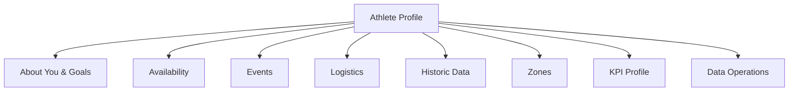

# FEAT: Modular User Inputs (Profile, Availability, Logistics, Events)

* **ID:** FEAT_user_inputs_modular
* **Status:** Approved
* **Owner/Area:** Data Model / UI
* **Last-Updated:** 2026-02-05
* **Related:** —

---

## 1) Context / Problem

**Current behavior**

* User inputs were primarily `season_brief_yyyy.md` and `events.md`, with availability parsed out to `availability.json`.
* A/B/C events lived in Season Brief, while logistics context lived in events.md.
* Updates to one concept often required editing a large, mixed document.

**Problem**

* Inputs are not modular; small changes (availability, events, logistics) require editing the Season Brief or events.md.
* Agents and prompts depend on input files that mix concepts and naming (logistics vs events).

**Constraints**

* Availability is now an editable input artefact; legacy parsing is optional and deprecated.
* Hard cut‑over: no runtime support for season_brief/events inputs.

---

## 2) Goals & Non-Goals

**Goals**

* [x] Split user inputs into clear, independently editable sections.
* [x] Separate logistics context from planning events.
* [x] Preserve current planning behavior with a hard cut‑over.

**Non-Goals**

* [ ] Maintain legacy season_brief/events inputs in runtime.
* [ ] Changing planning logic beyond input decomposition.

---

## 3) Proposed Behavior

**User/System behavior**

* Hard cut‑over to new modular inputs (no legacy fallback).
* Athlete Profile navigation order:
  1) **About You & Goals**
  2) **Availability**
  3) **Events**
  4) **Logistics**
  5) **Historic Data**
  6) **Zones**
  7) **KPI Profile**
  8) **Data Operations**
* Season Brief page becomes obsolete (hidden/removed from nav).

**Field mapping (initial proposal)**

* **Athlete Profile & Goals**
  - Athlete identity: Athlete-ID, Athlete-Name, Age, Sex, Age-Group
  - Sport profile: Primary-Discipline(s), Training Age
  - Context: Location-Time-Zone, Athlete-Story
  - Physical: Body-Mass-kg
  - Goals: Primary Objective, Secondary Objectives, Goal Priority Order
  - Success criteria, Risk Flags
  - Performance anchors: Endurance-Anchor-W, Ambition-IF-Range
  - Measurement assumptions only (historical baseline moved to separate artefact)
  - Constraints & limitations (injury history, time constraints, environmental constraints)
* **Availability (editable artefact)**
  - Weekly availability table, fixed rest days, travel windows, confidence, non‑negotiables
* **Logistics (context events)**
  - Non‑training events (travel/work/weather/etc.) with impact (availability/modality/recovery/data_quality)
* **Planning Events**
  - A/B/C events for planning with rich fields (distance, elevation, expected duration, time limit)
* **Historical Baseline (new artefact)**
  - Aggregated from Intervals (kJ/year, kJ/day, kJ/hour, long‑ride tolerance, etc.)
  - Updated on demand via UI action

**UI impact**

* UI affected: Yes
* Pages: Athlete Profile → About You & Goals, Availability, Events, Logistics, Historic Data (new), Zones, KPI Profile, Data Operations.

### UI Flow (Mermaid)

**Non-UI behavior (if applicable)**

* Components involved: workspace inputs, data pipeline, agent prompts/injection.
* Contracts touched: new input schemas; prompt updates; input loaders.

---

## 4) Implementation Analysis

**Components / Modules**

* Workspace inputs (`inputs/`) and `workspace_get_input` usage across agents.
* Data pipeline: availability parser becomes deprecated; availability is editable input.
* Data pipeline: historical baseline aggregation (Intervals → baseline artefact).
* UI: Athlete Profile pages + Data Operations (parse availability).
* Knowledge injection + agent prompts (Season/Scenario/Plan/Phase/Week/Coach).

**Data flow**

* Inputs: new input files for profile/goals, logistics, events; availability as editable input; historical baseline as derived input.
* Processing: availability editor writes new input artefact; baseline aggregator pulls from Intervals on demand.
* Outputs: availability.json (editable), historical_baseline.json (aggregated), plus planning artefacts use new inputs.

**Schema / Artefacts**

* New input schemas (target):
  - `athlete_profile.schema.json` (goals + profile)
  - `availability.schema.json` (editable input artefact)
  - `logistics.schema.json` (context formerly in events.md)
  - `planning_events.schema.json` (A/B/C with fields like distance, time limit, elevation)
  - `historical_baseline.schema.json` (Intervals‑aggregated metrics)
  - (Optional) `goals.schema.json` if we want strict separation from profile
* Existing:
  - legacy availability parsing is optional (deprecated) via Data Operations.
* Legacy Season Brief / events.md specs are deprecated as part of the cut‑over.

---

## 5) Impact Analysis (complete)

**Compatibility**

* Backward compatible: No (hard cut‑over).
* Breaking changes: Season Brief + events.md inputs are removed from runtime.
* Fallback behavior: None (explicitly disallowed).

**Conflicts with ADRs / Principles**

* None known; ensure alignment with documentation placement rules.

**Impacted areas**

* UI: new editors, new page labels, save flows.
* Pipeline/data: availability parser input source.
* Renderer: none.
* Workspace/run-store: new inputs under `inputs/`.
* Validation/tooling: new schemas, validators.
* Deployment/config: none.

**Required refactoring**

* Rename `events.md` to `logistics` input and create a new planning events input.
* Remove Season Brief input usage and related parsers.
* Update agent prompts to load new inputs only.
* Update Athlete Profile nav order + new pages (Events, Historic Data).
* Add historical baseline aggregator + UI “refresh” action.

---

## 6) Options & Recommendation

### Option A — New inputs with fallback to legacy

**Summary**

* Introduce new input schemas and editors; legacy inputs remain readable.

**Pros**

* Smooth migration; minimal breakage.

**Cons**

* Temporary dual-path complexity.

### Option B — Immediate replacement

**Summary**

* Remove legacy inputs and require new schemas.

**Pros**

* No dual-path complexity.

**Cons**

* High breakage risk; migration burden.

### Recommendation

* Choose: Option B (hard cut‑over).

---

## 7) Acceptance Criteria (Definition of Done)

* [x] New input schemas defined and validated.
* [x] Athlete Profile editors for profile/goals, logistics, planning events.
* [x] Legacy inputs removed from runtime (no fallback).
* [x] Agents/prompt injections updated to use new inputs.
* [x] Availability stored as editable input artefact and used by planners.
* [x] Historical baseline artefact generated from Intervals with manual refresh action.

---

## 8) Migration / Rollout

**Migration strategy**

* Hard cut‑over: remove legacy inputs immediately.

**Rollout / gating**

* No feature flag; cut‑over is immediate.

---

## 9) Risks & Failure Modes

* Missing new inputs → user must populate before planning.
* No legacy fallback → clear UI error states required.

---

## 10) Observability / Logging

* Log missing required inputs and blocked planning gates.

---

## 11) Documentation Updates

* [x] [doc/ui/pages/athlete_profile.md](../../ui/pages/athlete_profile.md) — new nav order + new pages.
* [x] [doc/architecture/workspace.md](../../architecture/workspace.md) — new inputs in `inputs/`.
* [x] [doc/overview/artefact_flow.md](../../overview/artefact_flow.md) — updated inputs.
* [x] Deprecation notices for Season Brief / events.md specs.

---

## 12) Link Map (no duplication; links only)

* UI flows/actions: [doc/ui/ui_spec.md](../../ui/ui_spec.md)
* UI contract: [doc/ui/streamlit_contract.md](../../ui/streamlit_contract.md)
* Architecture: [doc/architecture/system_architecture.md](../../architecture/system_architecture.md)
* Workspace: [doc/architecture/workspace.md](../../architecture/workspace.md)
* Schema versioning: [doc/architecture/schema_versioning.md](../../architecture/schema_versioning.md)
* Logging policy: [doc/specs/contracts/logging_policy.md](../contracts/logging_policy.md))
* ADRs: [doc/adr/README.md](../../adr/README.md)

---

## Open Questions (max 5) — optional

* Which Season Brief fields map to Profile & Goals vs Events?
* Preferred file naming for new inputs?
* Which baseline metrics are required vs optional (kJ/year, kJ/day, kJ/hour, long‑ride tolerance)?
