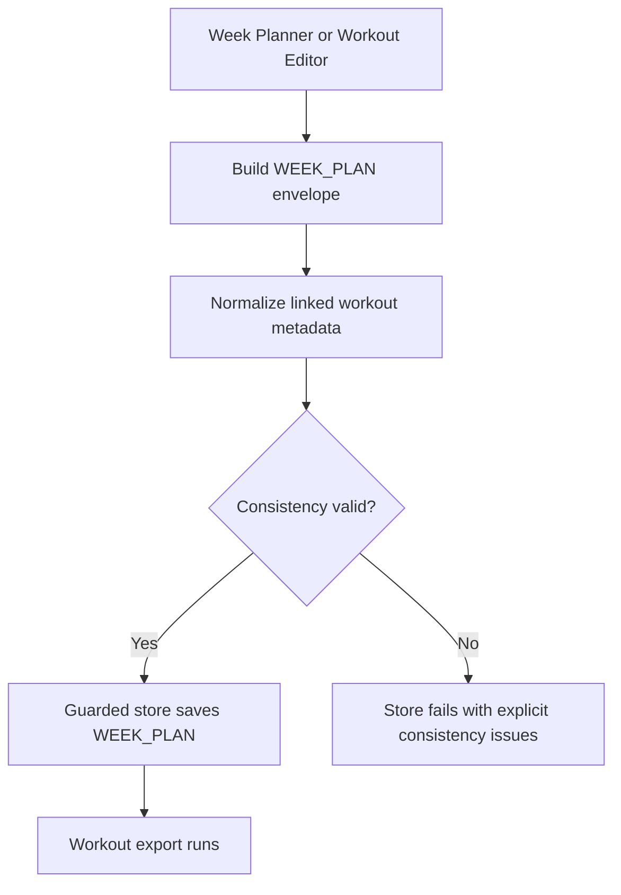

# FEAT: WEEK_PLAN Consistency Guards

* **ID:** FEAT_week_plan_consistency_guards
* **Status:** Approved
* **Owner/Area:** Planning / Workspace
* **Last-Updated:** 2026-05-04
* **Related:** `WEEK_PLAN`, `INTERVALS_WORKOUTS`, workout export validation

---

## 1) Context / Problem

**Current behavior**

* `WEEK_PLAN` artefacts are schema-validated and workout text is checked against the local cycling subset before export.
* Agenda rows, workout metadata, and summary notes are not cross-checked deeply enough for internal consistency.
* The local export path accepts any `WEEK_PLAN` that passes schema + workout text validation.

**Problem**

* A generated `WEEK_PLAN` can be internally inconsistent while still passing schema validation.
* Observed defect: a linked workout had a populated workout text and notes, but the agenda row contained `planned_duration = 00:00`, `planned_kj = 0`, and the workout duration degraded to `00:00:01`.
* This leads to incorrect agenda totals, incorrect summary statements, and a misleading `INTERVALS_WORKOUTS` export.

**Constraints**

* No schema version bump is desired for this fix.
* Workout export must remain deterministic and strict.
* `planned_weekly_load_kj` is a governance metric and must remain distinct from mechanical `planned_kj`.
* Existing bounded workout editor flows must keep working.

---

## 2) Goals & Non-Goals

**Goals**

* [x] Reject `WEEK_PLAN` artefacts with linked-workout agenda rows that are internally incoherent.
* [x] Derive agenda duration and mechanical kJ from workout-local data in one central place before store/export checks.
* [x] Add explicit consistency checks for agenda/workout/summary alignment.
* [x] Fix the concrete root-cause class where sentinel durations like `00:00:01` survive into stored `WEEK_PLAN` artefacts.

**Non-Goals**

* [ ] Rework the planning prompts or weekly load estimation model.
* [ ] Introduce a new artefact type or schema revision.

---

## 3) Proposed Behavior

**User/System behavior**

* Before a `WEEK_PLAN` is stored, the system normalizes linked workout metadata and validates cross-field consistency.
* If a linked workout has enough local information to derive duration and mechanical `planned_kj`, the system fills or repairs the agenda/workout metadata deterministically.
* If the `WEEK_PLAN` remains inconsistent after normalization, store fails with explicit validation errors.
* The same consistency layer is reused by the bounded workout editor previews and apply flow.

**UI impact**

* UI affected: Yes
* If Yes: Week planning and Workout Editor may now fail earlier with clearer consistency errors instead of storing/exporting broken artefacts.

### UI Flow (Mermaid)

**Non-UI behavior**

* Components involved:
  * `src/rps/workouts/*`
  * `src/rps/workspace/guarded_store.py`
  * `src/rps/agents/multi_output_runner.py`
  * `src/rps/orchestrator/week_plan_edits.py`
* Contracts touched:
  * `WEEK_PLAN`
  * `INTERVALS_WORKOUTS`

---

## 4) Implementation Analysis

**Components / Modules**

* `rps.workouts.week_plan_consistency`: central normalization and consistency checks.
* `rps.workouts.validator`: reuse consistency checks alongside workout-subset validation.
* `GuardedValidatedStore`: normalize + enforce consistency before saving `WEEK_PLAN`.
* `multi_output_runner`: normalize `WEEK_PLAN` before guarded store calls.
* `week_plan_edits`: reuse the same normalizer for previews/applies.

**Data flow**

* Inputs: `WEEK_PLAN.data.agenda`, `WEEK_PLAN.data.workouts`, `WEEK_PLAN.data.week_summary.notes`
* Processing:
  * derive workout duration from `workout_text`
  * treat `00:00:01` as invalid sentinel duration
  * derive agenda duration from workout duration
  * derive agenda mechanical `planned_kj` from workout notes when available
  * validate linked agenda/workout rows and weekly mechanical total note
* Outputs:
  * normalized `WEEK_PLAN`
  * explicit validation issues on failure

**Schema / Artefacts**

* New artefacts: none
* Changed artefacts: `WEEK_PLAN` values may be normalized before save
* Validator implications: `WEEK_PLAN` store/export now depends on additional cross-field consistency checks

---

## 5) Impact Analysis (complete)

**Compatibility**

* Backward compatible: Yes, at schema level
* Breaking changes: some previously accepted but inconsistent `WEEK_PLAN` payloads will now fail store
* Fallback behavior: deterministic normalization runs first; only still-invalid plans are rejected

**Conflicts with ADRs / Principles**

* Potential conflicts: none
* Resolution: aligns with deterministic validation and append-only artefact rules

**Impacted areas**

* UI: Week planning and Workout Editor surface clearer failures
* Pipeline/data: workout export no longer accepts internally inconsistent week plans
* Renderer: none
* Workspace/run-store: stricter `WEEK_PLAN` guardrail before save
* Validation/tooling: stronger local validator and new consistency helper
* Deployment/config: none

**Required refactoring**

* Extract central week-plan consistency logic out of ad-hoc editor parsing
* Reuse one duration/kJ derivation path across store/editor/export validation

---

## 6) Options & Recommendation

### Option A — Normalize then validate centrally

**Summary**

* Add one deterministic normalization and consistency layer for `WEEK_PLAN` and reuse it everywhere.

**Pros**

* Fixes the real bug class, not just one symptom
* Keeps validation strict while repairing safe, derivable fields
* Reduces drift between planner, editor, and export logic

**Cons**

* Adds some logic around note parsing and summary-note validation

**Risk**

* Over-normalization could hide planner defects if applied too broadly

### Option B — Validation only, no repair

**Summary**

* Reject inconsistent artefacts without trying to derive any missing fields.

**Pros**

* Simpler and stricter

**Cons**

* Leaves recoverable planner output unfixed
* Keeps duplicated derivation logic in editor paths

### Recommendation

* Choose: Option A
* Rationale: deterministic repair for safe fields plus strict validation gives the cleanest operational result.

---

## 7) Acceptance Criteria (Definition of Done)

* [ ] A `WEEK_PLAN` with linked `workout_id` and `planned_duration = 00:00` is rejected unless normalization can repair it.
* [ ] A `WEEK_PLAN` with workout `duration = 00:00:01` is rejected unless normalization can replace it from `workout_text`.
* [ ] Agenda `planned_duration` is kept aligned with workout duration for linked workouts.
* [ ] Agenda `planned_kj` can be filled from workout notes when the note contains deterministic `planned_kJ` metadata.
* [ ] Weekly summary mechanical total note is checked against the agenda sum when the note contains that statement.
* [ ] Validation passes: `py_compile`, targeted `pytest`, `run_lint.sh`, `run_typecheck.sh`.
* [ ] No regressions in `Workout Editor` preview/apply and `INTERVALS_WORKOUTS` export.

---

## 8) Migration / Rollout

**Migration strategy**

* No schema migration.
* Applies to newly stored/edited `WEEK_PLAN` artefacts only.

**Rollout / gating**

* Feature flag / config: none
* Safe rollback: revert the central consistency layer and guard-store hook

---

## 9) Risks & Failure Modes

* Failure mode: note parsing fails to extract mechanical `planned_kJ`
  * Detection: validation leaves agenda `planned_kj` unchanged
  * Safe behavior: no guessed value is inserted
  * Recovery: planner output must provide coherent value or a follow-up edit must fix it

* Failure mode: planner emits inconsistent summary-note total
  * Detection: new consistency issue
  * Safe behavior: store fails
  * Recovery: regenerate week plan or repair via editor after planner fix

---

## 10) Observability / Logging

**New/changed events**

* `WEEK_PLAN` store validation failure now includes consistency-specific issues
* Workout editor previews surface consistency issues from the same central checker

**Diagnostics**

* `rps.log`
* guarded store validation error payload
* preview/apply result in Workout Editor

---

## 11) Documentation Updates

Update these docs as part of implementation:

* [ ] `doc/overview/artefact_flow.md` — mention stricter `WEEK_PLAN` store/export consistency gate
* [ ] `doc/architecture/workspace.md` — mention `WEEK_PLAN` guarded consistency validation before save
* [ ] `doc/ui/pages/plan_workouts.md` — note that editor preview/apply uses the same consistency layer as the planner/store
* [ ] `CHANGELOG.md` — summarize the fix

---

## 12) Link Map

* `doc/ui/ui_spec.md`
* `doc/architecture/workspace.md`
* `doc/overview/artefact_flow.md`
* `specs/knowledge/_shared/sources/specs/mandatory_output_week_plan.md`
* `specs/knowledge/_shared/sources/specs/workouts/workout_syntax_and_validation.md`
* `specs/knowledge/_shared/sources/specs/load_estimation_spec.md`
