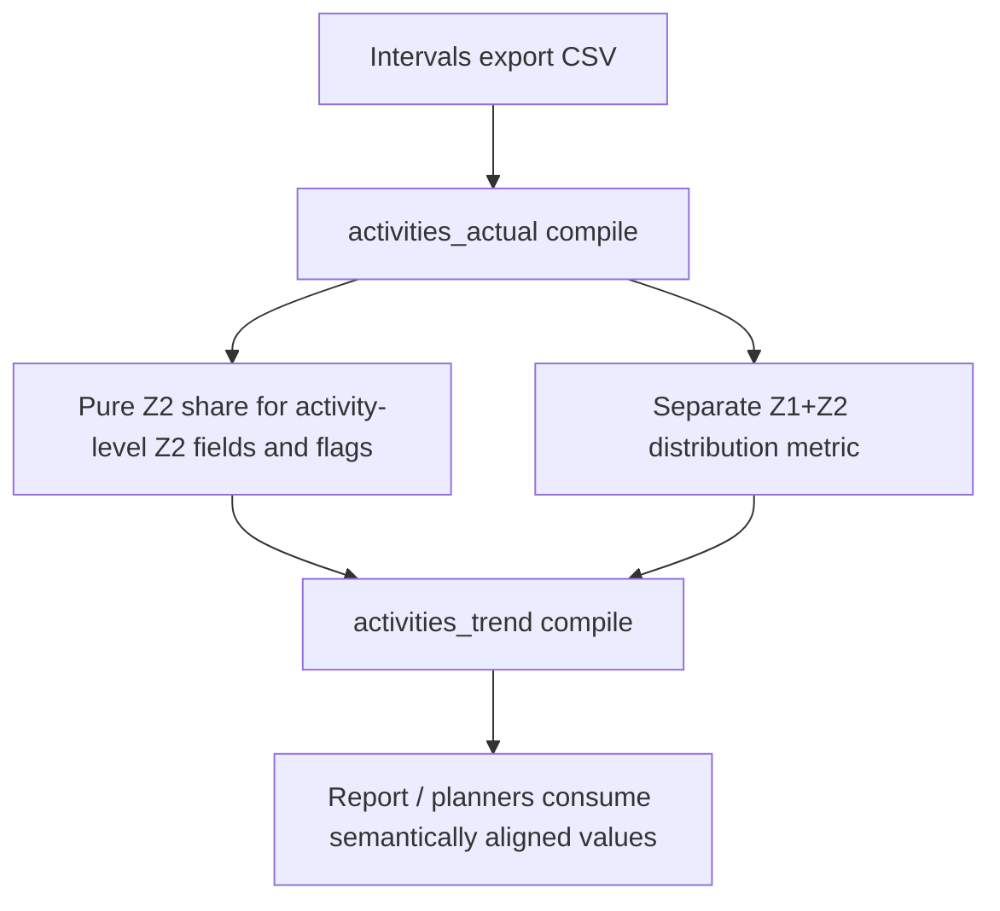

# FEAT: Align Z2 metric semantics across pipeline, artefacts, and reporting

* **ID:** FEAT_z2_metric_semantics_alignment
* **Status:** Implemented
* **Owner/Area:** Data Pipeline / Performance Analytics
* **Last-Updated:** 2026-05-11
* **Related:** `src/rps/data_pipeline/intervals_data.py`, `specs/schemas/activities_actual.schema.json`, `specs/schemas/activities_trend.schema.json`

---

## 1) Context / Problem

**Current behavior**

* The system exposes multiple aerobic distribution metrics:
  * `z1_z2_time_percent`
  * `z2_share_power_percent`
  * `weekly_z2_share`
* Policy and report language interpret `Z2 Share` as a genuine Z2-only signal.

**Problem**

* In the activities pipeline, the per-activity field `Power TiZ Share Z2 (%)` was computed as `(Z1 + Z2) / total power TiZ`.
* The same field name was then used to derive `Flag Z2 Share >= 60%/70%` and long-ride candidate flags.
* Weekly trend/report artifacts already store `z2_share_power_percent` as pure `Z2 / total power TiZ`, so the semantics were inconsistent across artefacts.

**Constraints**

* Existing policy language already binds baseline gates to `Z2 Share (Power) (%)`.
* The fix should preserve schema shape when possible; this is a semantics repair, not a redesign of the artefact family.
* Report/Planner consumers must stay compatible.

---

## 2) Goals & Non-Goals

**Goals**

* [x] Make every field named `Z2 Share` mean pure Z2, not `Z1+Z2`.
* [x] Keep `Z1+Z2` available as a separate low-intensity distribution metric.
* [x] Clarify weekly-vs-activity denominator semantics in docs/schemas.

**Non-Goals**

* [x] No broad redesign of the performance report narrative model.
* [x] No new artefact family or schema version line unless the repair requires it.

---

## 3) Proposed Behavior

**User/System behavior**

* `Z2 Share (Power) (%)` and `z2_share_power_percent` are defined as:
  * `Power TiZ Z2 / sum(Power TiZ Z1..Z7) * 100`
* `Z1 + Z2 Time (%)` remains the low-intensity distribution metric:
  * `(Power TiZ Z1 + Power TiZ Z2) / sum(Power TiZ Z1..Z7) * 100`
* `Weekly Z2 Share (%)` remains a weekly moving-time share:
  * `weekly_z2_time_total_min / weekly_moving_time_total_min * 100`

**UI impact**

* UI affected: Yes
* If Yes: Report/Data & Metrics display clearer semantics because upstream values now align with labels and policy.

### UI Flow (Mermaid)

**Non-UI behavior (if applicable)**

* Components involved: data pipeline, renderer labels, activities schemas, policy wording
* Contracts touched: `activities_actual`, `activities_trend`, report/planner context semantics

---

## 4) Implementation Analysis

**Components / Modules**

* `src/rps/data_pipeline/intervals_data.py`
  * central helper for power-zone share percentages
  * fix per-activity `Power TiZ Share Z2 (%)` formula to pure Z2
* `specs/schemas/activities_actual.schema.json`
  * describe `power_tiz_share_z2` as pure Z2 power-zone share
* `specs/schemas/activities_trend.schema.json`
  * describe `z1_z2_time_percent`, `z2_share_power_percent`, and `weekly_z2_share`
* `specs/knowledge/_shared/sources/policies/progressive_overload_policy.md`
  * clarify that `Z2 Share (Power) (%)` is pure Z2, not `Z1+Z2`

**Data flow**

* Inputs: Intervals export CSV with Power TiZ by zone
* Processing:
  * calculate zone-share percentages centrally
  * derive flags from pure Z2 share
* Outputs:
  * corrected `activities_actual` Z2 share + flags
  * aligned downstream trend/report semantics

**Schema / Artefacts**

* New artefacts: none
* Changed artefacts: semantics of existing `activities_actual.metrics.power_tiz_share_z2` repaired to match its name and downstream contract
* Validator implications: none structurally; schema descriptions/documentation updated

---

## 5) Impact Analysis (complete)

**Compatibility**

* Backward compatible: Mostly
* Breaking changes: numeric values for `power_tiz_share_z2` and derived flags may change for newly generated `activities_actual` artefacts
* Fallback behavior: downstream consumers already expect pure Z2 semantics

**Conflicts with ADRs / Principles**

* Potential conflicts: data contract semantics across derived artefacts
* Resolution: explicit ADR records that `Z2 Share` means pure Z2 and `Z1+Z2` is separate

**Impacted areas**

* UI: Report/Data & Metrics interpretation becomes coherent
* Pipeline/data: per-activity share and flags change
* Renderer: schema/label descriptions clarified
* Workspace/run-store: regenerated pipeline artefacts carry corrected values
* Validation/tooling: new unit coverage for the share helper
* Deployment/config: none

**Required refactoring**

* Centralize power-zone share math instead of ad-hoc formulas.

---

## 6) Options & Recommendation

### Option A — keep `Z2 Share` as pure Z2 and repair the buggy path

**Summary**

* Treat current policy/report semantics as authoritative and fix the activity pipeline to match.

**Pros**

* Aligns with existing policy language
* Minimizes downstream churn
* Keeps `Z1+Z2` available through a separate metric

**Cons**

* Existing generated `activities_actual` values/flags may differ after rebuild

**Risk**

* Low to moderate; historical comparisons of regenerated activity flags may shift

### Option B — redefine all `Z2 Share` references to mean `Z1+Z2`

**Summary**

* Rewrite policy/report semantics to match the buggy activity formula.

**Pros**

* Fewer changed numeric values in activity artefacts

**Cons**

* Conflicts with existing policy wording and athlete intuition
* Blurs true Z2 vs low-intensity distribution

### Recommendation

* Choose: Option A
* Rationale: `Z2 Share` should mean Z2. The current activity formula is the bug, not the policy.

---

## 7) Acceptance Criteria (Definition of Done)

* [x] Activity-level `Power TiZ Share Z2 (%)` is computed from pure Z2 time only.
* [x] `Flag Z2 Share >= 60%/70%` derives from the corrected pure-Z2 share.
* [x] `z1_z2_time_percent` remains available as the low-intensity distribution metric.
* [x] Docs/schemas explicitly distinguish pure Z2 vs `Z1+Z2`.
* [x] Validation passes: syntax, targeted tests, lint, typecheck.

---

## 8) Migration / Rollout

**Migration strategy**

* No schema shape migration.
* Regenerate pipeline artefacts to refresh corrected activity-level Z2 share and flags.

**Rollout / gating**

* Feature flag / config: none
* Safe rollback: restore prior formula and documentation, though that would reintroduce the semantic inconsistency

---

## 9) Risks & Failure Modes

* Failure mode: regenerated activity artefacts show lower `Z2 Share` values than before
  * Detection: compare `power_tiz_share_z2` before/after for long easy rides
  * Safe behavior: trend/report semantics remain internally consistent
  * Recovery: inspect TiZ columns and recompute shares directly from raw export

---

## 10) Observability / Logging

**New/changed events**

* none

**Diagnostics**

* Compare `Power TiZ Z1/Z2/...` columns against `Power TiZ Share Z2 (%)`
* Inspect `activities_actual` and `activities_trend` rendered tables

---

## 11) Documentation Updates

* [x] `specs/knowledge/_shared/sources/policies/progressive_overload_policy.md` — clarify pure-Z2 semantics
* [x] `specs/schemas/activities_actual.schema.json` — describe `power_tiz_share_z2`
* [x] `specs/schemas/activities_trend.schema.json` — describe share fields
* [x] `doc/adr/ADR-030-z2-metric-semantics.md` — architectural contract for Z2 metric meaning
* [x] `CHANGELOG.md` — record semantics repair

## 12) Link Map (no duplication; links only)

* Architecture: `doc/architecture/system_architecture.md`
* Workspace: `doc/architecture/workspace.md`
* Schema versioning: `doc/architecture/schema_versioning.md`
* ADRs: `doc/adr/ADR-030-z2-metric-semantics.md`
