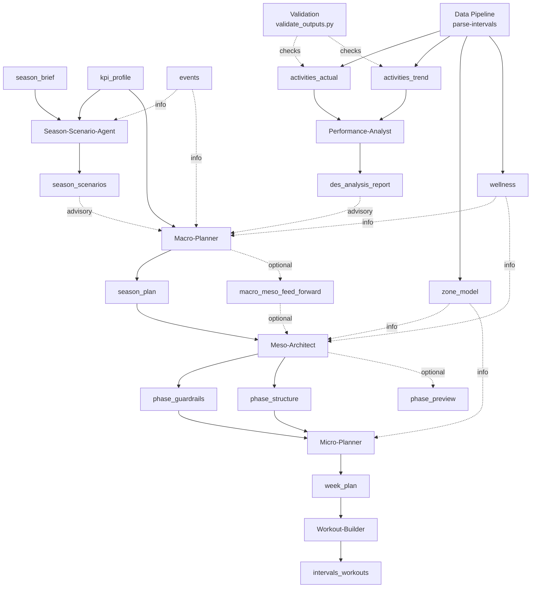
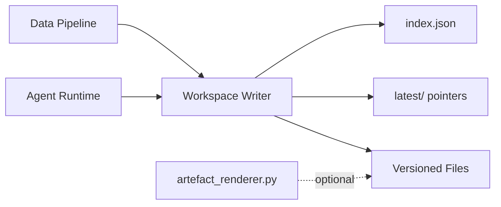

# System Architecture

Version: 2.2  
Status: Updated  
Last-Updated: 2026-01-23

---

## 1. Purpose & Scope

This document describes the technical architecture of the training planning system.
It covers:

- system components and responsibilities
- artifact contracts and validation
- prompt and knowledge delivery
- runtime storage and traceability

It is a system document, not a coaching manual.

---

## 2. System Overview

The system decomposes planning into specialized roles with strict authority boundaries.
Agents communicate via validated artifacts and never share implicit state.

### 2.1 End-to-End Flow (High Level)



**Core components**

1. **OpenAI Responses Runtime**
   - Tool-calling loop (file_search + function tools).
2. **Hosted Vector Stores**
   - Remote knowledge base (sources only in repo; embeddings remote).
3. **Prompt Loader**
   - Shared system prompt + per-agent prompt from `prompts/`.
4. **Workspace Storage**
   - Local file store under `var/athletes/` with versioned artifacts and `index.json`.
5. **Schema Validation**
   - JSON schema validation for all artifacts (envelope or raw payload).
6. **Orchestrator (optional)**
   - `plan-week` for Macro → Meso → Micro → Builder → Analysis sequencing.
7. **Streamlit UI (optional)**
   - Browser control surface: `PYTHONPATH=src streamlit run src/rps/ui/streamlit_app.py`.

---

## 3. Agent Roles & Responsibilities

### 3.1 Performance-Analyst
- Diagnostic only, advisory output.
- Consumes factual data + planning context.
- Produces `des_analysis_report` (advisory).

### 3.1.1 Data Pipeline (Assumed)

- Deterministic scripts ingest external activity data.
- Writes `activities_actual`, `activities_trend`, `zone_model`, `wellness`, and `availability` into the athlete workspace.
- Updates `latest/` so planners always read the freshest factual data.
- Pipeline entrypoint: `python -m rps.main parse-intervals`.
- Season Brief availability parser: `python -m rps.main parse-availability` (module: `rps.data_pipeline.season_brief_availability`).
- Validation helper: `scripts/validate_outputs.py`.
- Outputs are CSV+JSON under `data/` plus mirrored `latest/` copies.

### 3.2 Season-Scenario-Agent
- Produces `season_scenarios` (informational).
- Uses Season Brief (incl. weekday availability table) + KPI Profile to propose A/B/C options.
- No planning decisions; Macro-Planner remains binding authority.

### 3.3 Macro-Planner
- Defines long-term intent (8–32 weeks).
- Produces `season_plan` and optional `macro_meso_feed_forward`.
- Uses wellness `body_mass_kg` + Season Brief availability to anchor kJ corridor math.
- **Important:** Macro phases define ISO week ranges, but MUST NOT define meso blocks.

### 3.4 Meso-Architect
- Converts macro phase intent into phase guardrails and execution architecture.
- **Block ranges are derived from macro phases**, not calendar alignment.

### 3.5 Micro-Planner
- Produces weekly execution plan (`week_plan`).
- Must comply with governance + execution architecture.

### 3.6 Workout-Builder
- Deterministic conversion into Intervals.icu JSON (raw export payload).
- No planning decisions.

---

## 4. Knowledge Delivery

- **Prompts** live in `prompts/` and are loaded at runtime.
- **Knowledge sources** live in `knowledge/` and are synced to OpenAI hosted vector stores.
- At runtime, the Responses API attaches the **agent vector store** via file_search.

### 4.1 Vector Stores

#### 4.1.1 Stores, Purpose, and Contents

The system uses a single shared store for all agents:

- `vs_rps_all_agents`: unified knowledge store containing all specs, contracts,
  policies, schemas, and prompts used across agents.

Knowledge sources live under `knowledge/_shared/` and are listed in
`knowledge/all_agents/manifest.yaml`. The vector store itself is remote state.


#### 4.1.2 Handling (Init / Update / Delete)

The repo uses a single sync entrypoint to manage stores:

```bash
python scripts/sync_vectorstores.py
```

Internally, the flow is:

1. Create or resolve the vector store by name.
2. Upload changed files (hash-based delta).
3. Optionally prune remote files that no longer exist locally.

Example (minimal, direct API usage):

```python
from openai import OpenAI

client = OpenAI()

# 1) Ensure store
store = client.vector_stores.create(name="vs_rps_all_agents")

# 2) Upload file and attach
file_obj = client.files.create(file=open("knowledge/_shared/sources/specs/load_estimation_spec.md", "rb"),
                               purpose="assistants")
client.vector_stores.file_batches.create_and_poll(
    vector_store_id=store.id,
    files=[{"file_id": file_obj.id, "attributes": {"path": "rules.md"}}],
)

# 3) Remove a file from a store (detach)
client.vector_stores.files.delete(vector_store_id=store.id, file_id=file_obj.id)
```

Notes:
- The sync script writes `.cache/vectorstores_state.json` to map store names to IDs.
- IDs can be overridden via `.env` when needed.
- Deleting a file from the Files API is global; prefer detaching from the store.

#### 4.1.3 Vector Store Attributes and Filters

During sync, each source file is annotated with attributes derived from its
YAML header (Markdown) or schema/meta fields (JSON). These attributes are used
to filter `file_search` results.

Common attributes:
- `type`, `specification_for`, `specification_id`
- `interface_for`, `interface_id`
- `template_for`, `template_id`
- `contract_name`, `status`
- `scope`, `authority`, `version`
- `applies_to`, `explicitly_not_for`
- `normative_role`, `decision_authority`
- `doc_type`, `schema_id`, `schema_title`, `schema_for`

Example filters:
- Specs/policies/principles: `type=Specification` + `specification_for=WORKOUT_POLICY`
- Interfaces: `type=InterfaceSpecification` + `interface_for=SEASON_BRIEF`
- Templates: `type=Template` + `template_for=SEASON_BRIEF`
- Schemas: `doc_type=JsonSchema` + `schema_id=week_plan.schema.json`

`file_search` is for static knowledge sources only. Runtime athlete artifacts
are fetched via workspace tools.

#### 4.1.4 Agent Access Hints (Summary)

These are runtime access expectations per agent/mode. Knowledge sources should be
queried via `file_search` with attribute filters; athlete artefacts come from
workspace tools.

Macro-Planner
- Mode A: Season brief via `workspace_get_input("season_brief")`, KPI via `workspace_get_latest(KPI_PROFILE)`, optional events via `workspace_get_input("events")`.
- Mode B: Season brief, KPI, existing season plan via `workspace_get_latest(SEASON_PLAN)`, optional events.
- Mode C: DES report via `workspace_get_latest(DES_ANALYSIS_REPORT)`, optional events.

Meso-Architect
- Mode A (new block): `workspace_get_block_context(year, week)` and optional `offset_blocks=1`; optional `MACRO_MESO_FEED_FORWARD`, `ACTIVITIES_TREND`, `events`.
- Mode B (update): `workspace_get_block_context`, optional `MACRO_MESO_FEED_FORWARD`, `ACTIVITIES_ACTUAL`, `events`.
- Mode C (no-change): `workspace_get_block_context`, optional `events`.

Micro-Planner
- Mode A/B: `workspace_get_block_context`, optional `events`.
- Mode C: `workspace_get_block_context`, optional `BLOCK_FEED_FORWARD`, `events`.

Performance-Analyst
- Required: `ACTIVITIES_ACTUAL`, `ACTIVITIES_TREND`, `KPI_PROFILE` via `workspace_get_latest`.
- Optional: `SEASON_PLAN`, `workspace_get_block_context`, `events`.

Workout-Builder
- Required: `WEEK_PLAN` via `workspace_get_latest` (or `workspace_get_version` for a specific week).

#### 4.1.5 Per-Agent Mapping and Available Tools

Each agent attaches a single store at runtime:

- Single shared store for all agents (`vs_rps_all_agents`)

Tools available to agents:

- `file_search` (with `vector_store_ids=[agent]`)
- Workspace read tools:
  - `workspace_get_latest`
  - `workspace_get_version`
  - `workspace_list_versions`
  - `workspace_get_block_context`
  - `workspace_get_input` (season brief, events)
- Strict store tools (one per output artefact, schema-bound)

These tool sets are wired by the runtime and are consistent across agents.
File search is forced by default; use `--no-file-search` if you need to disable it.

### 4.2 Runtime Knowledge Injection (Base + Mode Bundles)

In addition to `file_search`, the runtime injects selected knowledge files
directly into the system prompt.

Configuration:
- `config/agent_knowledge_injection.yaml`

Model:
- Base block (always injected): `agents.<agent>.inject`
- Mode block (one bundle per run):
  - `agents.<agent>.modes.<mode>.bundle_id`
  - `agents.<agent>.bundles[].inject`

Effective injection for a run:
- base `inject` + selected bundle `inject` (+ any mode-specific `inject`)
- duplicates are removed while preserving order

Modes are chosen by the orchestrator/runner based on the task
(for example: `season_plan` vs `feed_forward`, or
`phase_guardrails` vs `phase_structure`, or `coach`).

#### 4.1.4 Operational Limits

- Keep single files reasonably small (split large PDFs into chapters).
- Prefer fewer, higher-signal sources over many redundant files.
- Avoid frequent full resyncs; use delta upload in `sync_vectorstores.py`.
- Remember that chunking and embeddings are managed by OpenAI (remote state).

#### 4.1.5 Data Sensitivity

- Never upload private or licensed material without explicit permission.
- Keep athlete-specific data out of vector stores; use `var/athletes/`.
- Avoid placing any API keys or secrets in `knowledge/`.

#### 4.1.6 Incident Playbook

If a store gets out of sync or corrupted:

1. Re-run `python scripts/sync_vectorstores.py` (default is safe, delta-based).
2. If needed, use `--prune` to remove remote files missing locally.
3. If a store must be rebuilt:
   - Create a new store name.
   - Update `manifest.yaml` and re-sync.
   - Update `.env` or `.cache/vectorstores_state.json`.

---

## 5. Workspace & Traceability

### 5.1 Workspace Handling (Local Files)

The workspace is a **local, append-only file store** under `var/athletes/<athlete_id>/`.
It is the single source of truth for planning artefacts and factual data in dev.

**Directory layout**

```
var/athletes/<athlete_id>/
  data/
    plans/macro/
    plans/meso/
    plans/micro/
    analysis/
    exports/
    YYYY/WW/
  latest/
  index.json
  logs/
```



**Key rules**

- Every write creates a **versioned file** (e.g. `phase_structure_2026-05--2026-08.json`).
- `latest/` holds the most recent version per artefact type.
- `index.json` tracks per-version metadata for routing and exact range lookups.
- The workspace is **gitignored** and should never be committed.

**Data pipeline outputs**

The data pipeline writes factual artefacts and mirrors them to `latest/`:

- `activities_actual_yyyy-ww.json`
- `activities_trend_yyyy-ww.json`

These are validated against schemas and indexed for downstream analysis.

**Rendering (optional)**

Use `scripts/artefact_renderer.py` to generate human-readable sidecars from JSON.

---

Artifacts are stored under `var/athletes/<athlete_id>/data/`:

- `data/plans/macro/`, `data/plans/meso/`, `data/plans/micro/`, `data/analysis/`, `data/exports/`
- `data/YYYY/WW/` holds data pipeline snapshots (CSV + JSON)
- `latest/` contains the most recent artifact per type.
- `index.json` records per-version metadata for lookup and routing.

All artifacts are **append-only**; updates are new versions with new run IDs.

---

## 6. Validation & Contracts

- Artifacts are validated against schemas under `schemas/`.
- Envelope artifacts use `{ "meta": { ... }, "data": { ... } }`.
- Raw payloads (e.g., Intervals export) are validated against their raw schema.

Authority values are enforced by schema (Binding/Derived/Informational/Factual).
The local store normalizes legacy labels (e.g., Structural → Derived).

## 6.1 Artefact Renderer

- Script: `scripts/artefact_renderer.py`
- Templates: `scripts/renderers/*.md.j2`
- Purpose: produce human-readable `.md` sidecars (informational only).

---

## 7. Orchestration (Optional)

The `plan-week` command runs a staged plan if required artifacts are missing:

1. Macro
2. Meso (phase guardrails + execution arch)
3. Micro (weekly plan)
4. Builder (Intervals export)
5. Analysis (DES report)

Routing uses:
- Macro phase → block range resolution
- `index.json` for exact range matching

---

## 8. Design Principles

- **Contract-first:** inputs/outputs are explicit.
- **Deterministic storage:** local workspace is append-only.
- **Separation of concerns:** knowledge vs runtime data.
- **Strict validation:** schema compliance before persistence.
- **Traceability:** every artifact records run ID and upstream references.

---

## 9. Non-Goals

- Automatic scheduling without explicit artifacts.
- Silent edits of existing artifacts.
- Embeddings or vector store state inside the repo.

---

## 10. Build & Setup Checklist

Use this checklist to initialize a fresh environment:

1. Copy `.env.example` to `.env` and set `OPENAI_API_KEY`, `ATHLETE_ID`,
   `API_KEY`, and `BASE_URL`.
2. Install dependencies: `pip install -r requirements.txt` or `pip install -e .`
   (depending on how you set up the repo).
3. Add knowledge sources under `knowledge/_shared/sources/` and update `knowledge/all_agents/manifest.yaml`.
4. Build bundled schemas: `python scripts/bundle_schemas.py`.
5. Sync vector stores: `python scripts/sync_vectorstores.py`.
6. (Optional) Run smoke test: `python scripts/smoke_vectorstores.py --store vs_rps_all_agents --force-tool`.
7. Run data pipeline: `python -m rps.main parse-intervals`.
8. Validate outputs: `python scripts/validate_outputs.py`.

---

## End
