# UI Flow (Athlete-First)

This document describes the UI flows, pages, and actions aimed at making planning as simple as possible for the athlete. It is the **central UI specification** that implementation should follow.

## Scope

- UI flows and action behavior
- Page responsibilities and required actions
- Orchestrator calls per action
- Global UI contract (sidebar + status)

See `doc/architecture/system_architecture.md` for C4 diagrams and system-level context.

## Goals

- One primary action: **“Plan my week”**
- Automatic gating: detect missing inputs and offer fix actions
- Safe defaults: run the full chain if ready; otherwise, run only what’s needed
- Clear feedback: show what happened, what changed, and what still needs input

## Global UI Contract

### Global Sidebar (non‑Coach pages)
- Inputs: Athlete ID, ISO Year, ISO Week, Phase (if available), Dev Mode
- Purpose: global state only, no heavy IO

### Status Panel (all non‑Coach pages)
- Single banner with state: idle/running/done/error
- Shows last action + run ID (if present)

## Pages and Responsibilities

### Home
- Marketing text (markdown) from `static/marketing/home.md`
- System state table: artifact availability, owner, description, ISO validity
- See `doc/ui/pages/home.md`.

### Plan → Plan Hub
- Orchestration layer: readiness checklist, run planning, execution status
- Actions enqueue runs only (no direct agent calls)
- See `doc/ui/pages/plan_hub.md`.

### Plan → Season
- Actions: select scenario + KPI segment
- Create Scenarios + Create Season Plan are initiated from Plan Hub
- Reset/Delete handled in Plan Hub
- See `doc/ui/pages/plan_season.md`.

### Plan → Phase
- Phase read-only view (details + preview)
- See `doc/ui/pages/plan_phase.md`.

### Plan → Week
- Read-only agenda summary + workouts list (planning runs in Plan Hub)
- See `doc/ui/pages/plan_week.md`.

### Plan → Workouts
- Workouts export view, posting actions, history
- Revision requests for week plan
- See `doc/ui/pages/plan_workouts.md`.

### Analyse
- Data & Metrics (weekly load + corridor overlays), Report (Narrative/KPI/Trend sections), Feed Forward
- See `doc/ui/pages/performance_data_metrics.md`, `doc/ui/pages/performance_report.md`, `doc/ui/pages/performance_feed_forward.md`.

### Athlete Profile
- About You, Season Brief, Availability, KPI Profile, Logistics, Zones, Data Operations
- See `doc/ui/pages/athlete_profile.md`.

### System
- Status (running processes + latest artefacts)
- History, Log
- See `doc/ui/pages/system_status.md`, `doc/ui/pages/system_history.md`, `doc/ui/pages/system_log.md`.

## Action Specification Template

For each UI action, document:
- **Action name**
- **Page**
- **Preconditions**
- **Orchestrator call**
- **Writes/side‑effects**
- **UI feedback**

## Action Specifications

### Plan Hub — Orchestrated Run
- **Preconditions:** readiness not blocked (inputs present, within Season Plan range)
- **Orchestrator call:** enqueue run via queue scheduler
- **Writes:** Run Store (`run.json`, `steps.json`, `events.jsonl`)
- **UI feedback:** status banner + run table
- **Agents:** season_scenario, season_planner, phase_architect, week_planner, workout_builder

### Plan Hub — Scoped Run
- **Preconditions:** readiness not blocked (inputs present, within Season Plan range)
- **Orchestrator call:** enqueue scoped run with `process_subtype`
- **Writes:** Run Store
- **UI feedback:** status banner + run table
- **Agents:** subset depending on scope

### Plan → Season — Create Scenarios
Handled by **Plan Hub — Scoped Run** (scope: Season Scenarios). The Season page no longer triggers this action.

### Plan → Season — Select Scenario
- **Preconditions:** scenarios exist
- **Orchestrator call:** `select_season_scenario(...)`
- **Writes:** `season_scenario_selection`
- **UI feedback:** success banner + rerun
- **Agent:** season_scenario

### Plan → Season — Create Season Plan
Handled by **Plan Hub — Scoped Run** (scope: Season Plan). The Season page no longer triggers this action.

### Plan → Week — Plan Week
Handled by **Plan Hub — Orchestrated Run** (or Scoped: Week Plan). The Week page is view-only.

### Plan → Workouts — Post to Intervals
- **Preconditions:** workouts export exists
- **Orchestrator call:** `post_to_intervals_commit(...)`
- **Writes:** posting receipts
- **UI feedback:** success/error banner + status update
- **Agent:** none (commit step)

### Plan → Workouts — Revise Week Plan
- **Preconditions:** coach message provided
- **Orchestrator call:** `revise_week_plan(...)`
- **Writes:** `week_plan`
- **UI feedback:** output expander + status banner
- **Agent:** week_planner
- **Prompt requirement:** include user input text in the prompt

### Athlete Profile — Data Operations — Create Backup
- **Preconditions:** athlete workspace exists
- **Orchestrator call:** none (local archive creation)
- **Writes/side-effects:** creates an in-memory archive for download
- **UI feedback:** success banner + download button

### Athlete Profile — Data Operations — Validate Backup (Dry-Run)
- **Preconditions:** archive uploaded
- **Orchestrator call:** none (local validation)
- **Writes/side-effects:** none
- **UI feedback:** validation status + file count in scope

### Athlete Profile — Data Operations — Restore Backup
- **Preconditions:** archive uploaded + user confirmation; target workspace empty unless force
- **Orchestrator call:** none (local restore)
- **Writes/side-effects:** writes files into `var/athletes/<athlete_id>/` per scope
- **UI feedback:** success/error banner + count of restored files

#### Flow: Data Operations (Backup & Restore)

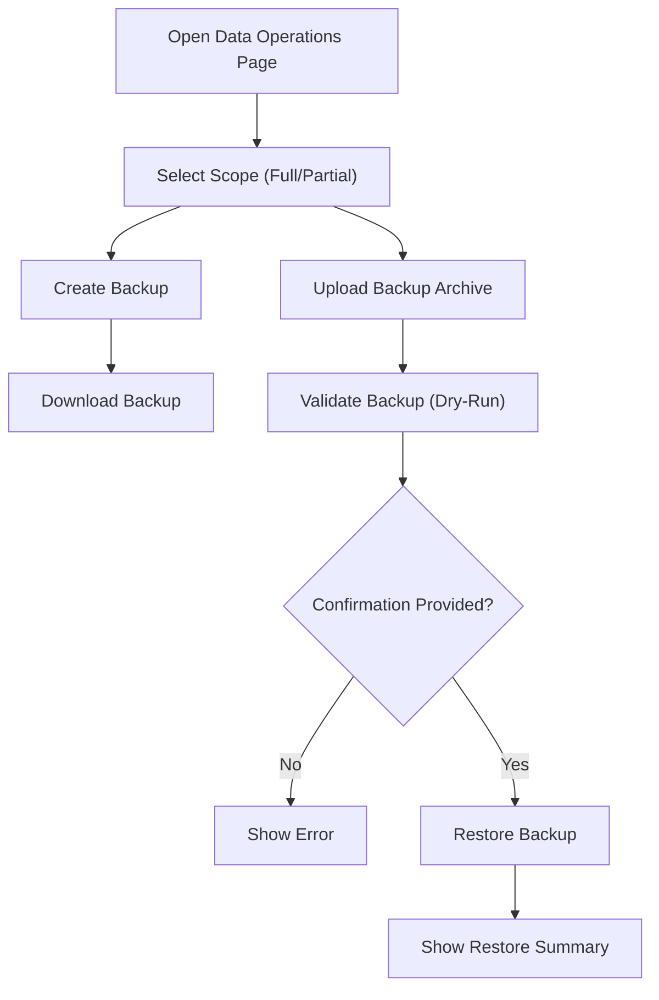

## Explanation

### Pages and responsibilities

- **Plan Hub:** readiness checks, primary CTA, and orchestration of automatic planning steps.
- **Plan → Season:** scenario selection UI (if not already selected).
- **Plan → Workouts:** workout export flow.
- **Post Workouts:** posting to Intervals (separate from planning completion).

### 1) Entry point: Plan Hub
- When the athlete opens the Plan Hub, the app automatically loads athlete ID and ISO week.
- The primary CTA remains **“Plan my week”** (or similar). This keeps the interaction simple.
- The CTA is pre-selected:
  - If the current week is fully ready: **Plan Next Week**
  - Otherwise: **Plan Week** (current week)

### 2) Input auto-check
- The system checks for Season Brief, Events, KPI Profile, Availability, Zone Model, and Wellness.
- If any are missing, the UI shows a short inline form or link to the relevant input page.
- Once completed, the app returns to the planning flow without the athlete needing to navigate.

### 3) Scenario creation + selection
- If scenarios are missing, run the scenario generator automatically.
- Present a compact A/B/C summary and prompt for selection if none exists.
- Require a KPI guidance segment selection (from KPI Profile) as part of scenario selection.
- If selection is already present, skip this step entirely.

### 4) Planning cascade (Season → Phase → Week → Workouts)
- The system checks for freshness of each artifact in order:
  - **Season Scenarios:** `season_scenarios`
  - **Scenario Selection:** `season_scenario_selection`
  - **Season Plan:** `season_plan`
  - **Phase Planning:** `phase_guardrails`, `phase_structure`, `phase_preview`
  - **Week Plan:** `week_plan`
- **Workouts Export:** `workouts_yyyy-ww.json` (Intervals export)
- If an artifact is missing or stale, it is regenerated automatically.
- Each step only runs if it is required (the chain is incremental, not always full).

### 5) Workout export and posting
- Once the week plan is ready, export workouts automatically. **Planning ends here.**
- Posting to Intervals is a **separate Post Workouts flow** and only runs from the Workouts page.

### 6) Completion summary
- The final screen shows:
  - What steps ran
  - Which artifacts were updated
  - Any outstanding issues or blocked items
  - Links to view the results (Plan, Week, Workouts)

---

## Flow Catalog (Detailed)

### Flow: Plan (Orchestrated)

- **Entry:** Plan Hub → “Plan this Week”
- **Preconditions:** readiness not blocked (includes KPI Profile present)
- **Steps:** Scenarios → Selection → Season Plan → Phase → Week → Export
- **Orchestrator:** queue scheduler (planning run)
- **Outputs:** `season_scenarios`, `season_scenario_selection`, `season_plan`, `phase_guardrails`, `phase_structure`, `phase_preview`, `week_plan`, `workouts_yyyy-ww.json`
- **Writes:** replace all relevant `latest/` artefacts on each step
- **UI feedback:** status banner + execution table

#### Diagram (Plan Orchestrated)

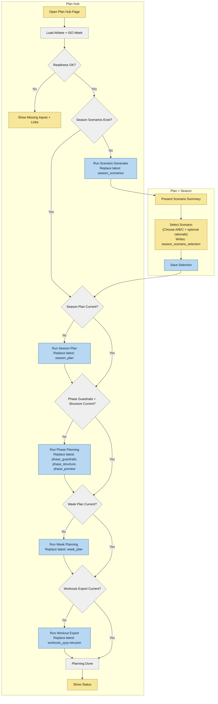

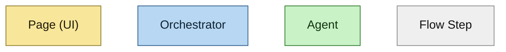

### Flow: Plan (Scoped)

- **Entry:** Plan Hub → “Run scoped”
- **Preconditions:** readiness not blocked (includes KPI Profile present)
- **Steps:** select scope → optional override (only when modifying existing artefacts) → re-plan selected scope + all lower levels
- **Orchestrator:** queue scheduler (planning run)
- **Outputs:** scope-level artefacts + lower-level artefacts
- **Writes:** replace all affected `latest/` artefacts
- **UI feedback:** status banner + execution table

#### Diagram (Plan Scoped)

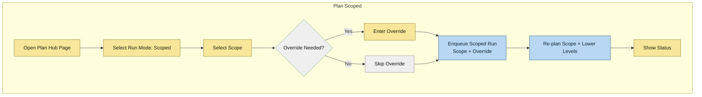

### Flow: Reset/Delete Season Plan

- **Entry:** Plan Hub → “Season Plan: Delete or Reset”
- **Reset removes:** `season_plan`, `phase_*`, `week_plan`, `workouts_yyyy-ww.json`
- **Delete removes:** reset artefacts + `season_scenarios`, `season_scenario_selection`
- **Writes:** delete `latest/` artefacts listed above before re-planning
- **UI feedback:** removed artefacts list + status banner

#### Diagram (Reset/Delete Season Plan)

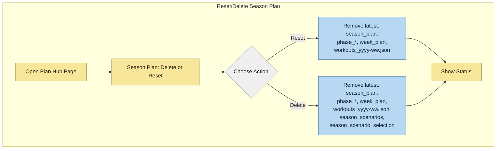

### Flow: Workouts Adapt + Post

- **Entry:** Plan → Workouts
- **Preconditions:** week plan exists, within Season Plan range
- **Outputs:** updated `week_plan`, `workouts_yyyy-ww.json`, posting receipts
- **Writes:** replace `latest/` week plan + workouts export when updated
- **UI feedback:** output expander + status banner

#### Diagram (Workouts Adapt + Post)

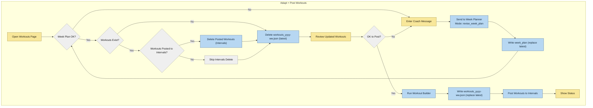

### Flow: Plan Week (Scoped, Recommended)

- **Entry:** Plan Hub → “Run scoped” (Week Plan)
- **Preconditions:** current or next ISO week; within Season Plan range
- **Behavior:** generates any missing upstream artefacts (Phase Guardrails/Structure) before week plan
- **Outputs:** `week_plan`, `workouts_yyyy-ww.json`
- **Writes:** replace `latest/` week plan + workouts export (and upstream artefacts if regenerated)
- **UI feedback:** status banner + execution table

#### Diagram (Plan Week Scoped)

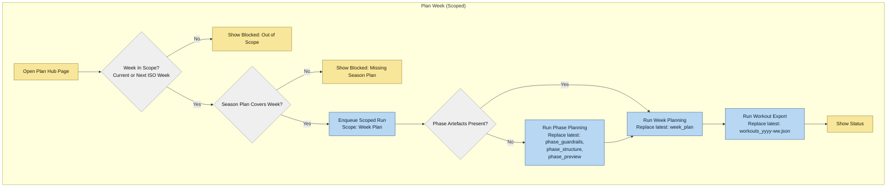

### Flow: Feed Forward

- **Entry:** Analyse → Feed Forward
- **Preconditions:** KPI Profile present
- **Steps:** DES Report → Season→Phase feed forward → Phase→Week feed forward
- **Outputs:** `des_analysis_report`, `season_phase_feed_forward`, `phase_feed_forward`
- **UI feedback:** status banner + summary table

#### Diagram (Feed Forward)

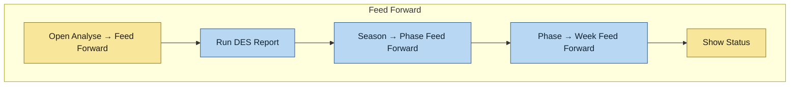

### Flow: Performance Report

- **Entry:** Analyse → Report
- **Outputs:** `des_analysis_report`
- **UI feedback:** status banner + reasoning log

#### Diagram (Performance Report)

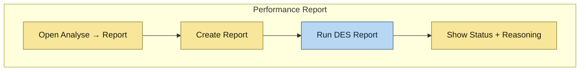

### Flow: Data Pipeline Refresh

- **Entry:** Data & Metrics → “Refresh Intervals Data”
- **Outputs:** `activities_actual`, `activities_trend`, `zone_model`, `wellness`, `availability`
- **Writes:** replace `latest/` activities + wellness/zone model outputs
- **UI feedback:** status banner + System → Status updates

#### Diagram (Data Pipeline Refresh)

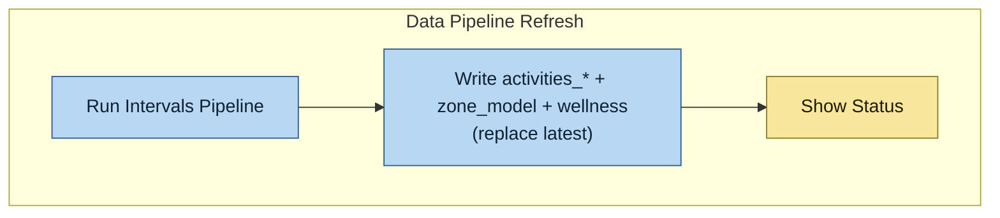

### Flow: Inputs Update

- **Entry:** Athlete Profile pages (Season Brief, Events, KPI, Availability)
- **Outputs:** input artefacts in `latest/`
- **Writes:** replace `latest/` input artefacts
- **UI feedback:** readiness reflects staleness in Plan Hub

#### Diagram (Inputs Update)

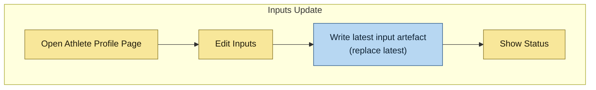

## Implementation Notes

- **Readiness evaluation** should be deterministic and based on “latest” artifacts.
- **Stale detection** should compare timestamps and ISO week ranges.
- **Auto-run** should be safe: only write missing or outdated artifacts.
- **No dangling artifacts:** every flow must leave `latest/` fully updated for all artifacts it owns.
- **Replace semantics:** when an artifact is re-generated, delete the existing `latest/` copy first, then write the new version.
- **Prerequisites:** planning actions only run when their required upstream artifacts exist and are within the active Season Plan ISO range.
- **Athlete simplicity** comes from a single CTA and minimal decision points.
- **Optional toggles** (advanced panel): auto-post, allow delete, validation only.

## Future Enhancements

- Background job queue for long runs with progress indicators.
- Notification banner when planning is done (email/push optional).
- Auto-retry for transient failures with clear logs.
