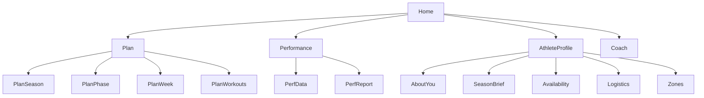

# UI System Overview (for Expert Review)

This document describes the current Streamlit UI at a systems level so a UI/UX expert can review structure, flow, and recommend whether to keep **separate Plan subpages** or move to a **single Plan hub**.

---

## 1) Executive Summary

**Current structure:** Multi‑page Streamlit app with distinct sections (Home, Coach, Performance, Plan, Athlete Profile).  
**Plan** is split into subpages: Season, Phase, Week, Workouts (Workouts of the Week).  
**Status**: Each page uses a **global sidebar** (athlete + ISO week + phase) and a **single always‑visible status banner**.

**Key question:**  
Should planning stay **distributed across subpages** (Season/Phase/Week/Workouts) or be consolidated into a **single “Plan Hub”** that also surfaces model execution state and run history?

---

## 2) Global UI Contract (Current)

### Global Sidebar (non‑Coach pages)
- Inputs: Athlete ID, ISO Year, ISO Week, Phase (if available), Dev Mode
- Purpose: global state, no heavy IO

### Status Panel (all non‑Coach pages)
- Single banner with state: idle/running/done/error
- Shows last action + run ID (if present)

---

## 3) Page‑by‑Page Overview (Current)

### Home
- Marketing text (markdown) from `static/marketing/home.md`
- System state table: artifact availability, owner, description, ISO validity

### Plan → Season
- Actions (collapsed expander):
  - Create Scenarios
  - Select Scenario + Rationale
  - Create Season Plan
  - Reset/Delete
- Status banner shows progress + last action
- Main content: Season Plan render + selected scenario summary + phases

### Plan → Phase
- Select phase via sidebar
- Phase details + preview + weekly agenda
- Status banner: “Viewing …”

### Plan → Week
- Weekly Agenda summary (expander)
- Workouts list: per‑day expanders with:
  - Title, notes, date, duration, load
  - Workout text as code block
- Status banner: “Planning week …” etc.

### Plan → Workouts
- Loads Intervals export (`workouts_yyyy-ww.json`)
- Per‑workout expanders with description (code block)
- Status banner: “Viewing …”

### Performance
- Data & Metrics: charts from intervals pipeline
- Report: run report generation + reasoning display

### Athlete Profile
- Season Brief, Events, Availability, Zones, Logistics
- Status banner for readiness/errors

---

## 4) Current Planning Flow (Conceptual)

1. **Inputs** (Season Brief, Events, KPI, Availability, Zones)  
2. **Season Scenarios** → **Scenario Selection** → **Season Plan**  
3. **Phase Preview/Structure** from Season Plan  
4. **Week Plan** (target ISO week)  
5. **Workout Builder** (Intervals export)  
6. **Performance** (intervals pipeline + DES report)

---

## 5) Mermaid Diagrams

### 5.1 Page Architecture



### 5.2 Planning Flow (Artifact Pipeline)

```mermaid
flowchart LR
  Inputs[Inputs: Season Brief, Events, KPI, Availability, Zones]
  Inputs --> Scenarios[Season Scenarios]
  Scenarios --> Selection[Scenario Selection]
  Selection --> SeasonPlan[Season Plan]
  SeasonPlan --> PhasePreview[Phase Preview/Structure]
  PhasePreview --> WeekPlan[Week Plan]
  WeekPlan --> Intervals[Intervals Export (workouts_yyyy-ww)]
  Intervals --> Perf[Performance Reports]
```

---

## 6) Plan Hub vs. Separate Pages — Decision Matrix

### Option A: Keep Separate Plan Pages
**Pros**
- Focused scope per task
- Cleaner state management per step
- Easier to debug and test

**Cons**
- Users must hop pages to follow the pipeline
- Harder to see run history/agent state in one place

### Option B: Central “Plan Hub”
**Pros**
- Single surface for pipeline status + runs
- Easier to show model execution logs + artifacts
- Better for overview + “what’s next”

**Cons**
- Risk of becoming cluttered
- More complex state/rerun logic
- Harder to maintain modular tests

---

## 7) Questions for UI Expert

1. Should the **Plan workflow** be represented as a single guided hub or remain split by artifact stage?
2. What is the most intuitive representation of **model execution state** (timeline, checklist, activity feed)?
3. How should **artifact readiness** and **validation status** be visualized?
4. Should “Week” and “Workouts” merge into one page or remain separate?
5. Is the global sidebar the right place for ISO week/phase selection, or should those live in context panels?

---

## 8) Recommendation (Current Engineering Constraints)

Given Streamlit rerun behavior and testability, **separate pages** are simpler and safer.  
If a Plan Hub is desired, consider it as a **summary + orchestration layer** that links out to the specialized pages rather than fully replacing them.
